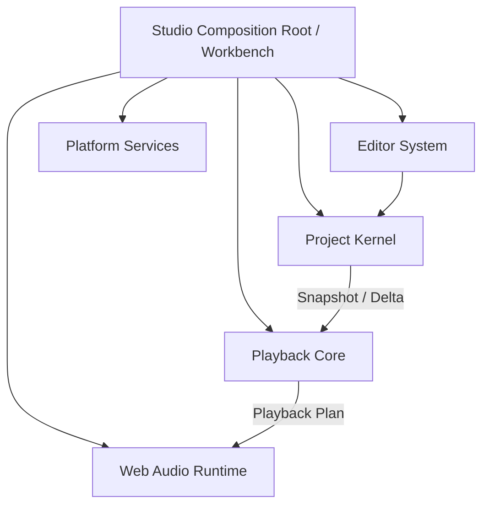
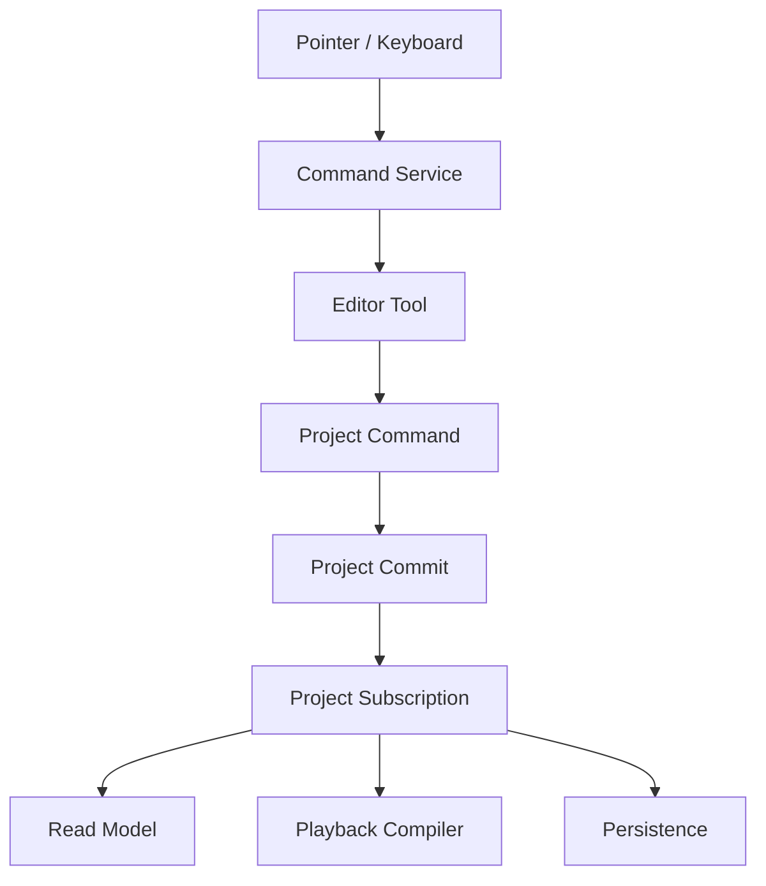

# Web DAW 简洁架构总纲

> 技术基线：Vue 3 + TypeScript + Vite + Web Audio API + pnpm Workspace  
> 产品定位：桌面浏览器优先、面向个人创作者的轻量 Web DAW  
> 文档作用：回答系统如何拆分、模块如何依赖，以及从哪里开始开发  
> 详细设计：遇到具体模块时再查阅 Web DAW 长期路线与架构设计 v3\
> 最近校准：2026-08-18

---

## 0. 如何使用这份文档

这份总纲只负责三件事：

1. 固定长期不应反复改变的架构主干；
2. 规定模块职责和依赖方向；
3. 给出第一条可直接开工的纵向功能链。

它不提前设计 AudioClip、Automation、Recording、Asset GC 等具体算法。开发到相应模块时，再单独补充设计文档和 ADR。

### 0.1 当前实现校准

本文描述长期稳定边界，不是“所有方框均已实现”的状态清单。当前真实能力以
[产品功能手册](../../PRODUCT.md)为准；已完成的首个 Playback 切片以
[Audible MIDI Playback V1 阶段计划](../../packages/playback/docs/audible-midi-playback-v1-phase-plan.md)
为准。这里的 Audible MIDI Playback `V1` 指第一版可听产品纵向切片，不是本总纲或长期
架构文档的版本号。

截至 2026-08-18，Project / Studio / Persistence 与 Piano Roll Add、Move、单 Note Resize、
多选 Delete 已形成闭环；Studio 首次可听闭环已通过功能审核。Playback Batch 6 已增加完整 Plan
Reconciliation、Transport 原位 handoff 和选择性 Voice 生命周期，播放中 Note / Track /
Instrument 变化可以保留无关活动 Voice；Batch 7A–7E 已交付派生 150 小节 Timeline、独立
Arrangement 滚动权威、共享视觉位置，以及 Arrangement / Track / Clip Focus Playhead 和分页
Follow；Batch 7F 加固与文档同步也已通过审核。Audible MIDI Playback V1 已在验收基线
`f1d0298` 完成；阶段 checkpoint tag 尚未创建。长期架构中的通用 Graph、RuntimeDelta、跨线程
ACK 和 AudioWorklet 路径仍不能反推为该已完成切片的必做范围。

后续独立的
[Manual Timeline Locate V1](../../packages/playback/docs/manual-timeline-locate-v1-phase-plan.md)
已完成四个主批次和一个 Playhead 纵向可见性 UX 修正，并通过统一审核与用户浏览器验证：
Playback Transport 拥有浏览器无关的 Tick Locate 与运行时
Return Anchor；Studio Coordinator 拥有静默事务、generation / Voice 失效和 Runtime 保留；
Arrangement 只拥有 Pointer / Keyboard、Preview、边缘滚动与 Follow。该切片不重新打开 Audible
MIDI Playback V1，也不建立 Project Seek Fact、可听 Scrub 或 Note Chase。阶段 checkpoint 为
`checkpoint/manual-timeline-locate-2026-08-18`。

当前下一条纵向切片是
[Standard MIDI File Import / Export V1](../../packages/midi-file/docs/midi-import-export-v1-phase-plan.md)。
新建的 `midi-file` 只拥有中立 SMF Document 与可替换 Decoder / Encoder Adapter，不依赖 Project
Core 或 Browser；`project-midi` 独立拥有 MIDI Document 与 Project Model 的双向映射，不拥有项目
生命周期或默认音源选择。`ActiveProjectService` 能把调用方验证过的 Session 作为新项目保存并激活，
`platform-browser` 提供本地 Blob 字节读取；Studio 当前已在 Project Entry 组合文件选择、Codec、
Bridge、默认 Studio Grand 与项目生命周期，阻断失败不写入项目，非阻断诊断通过摘要反馈。MIDI
Export 仍留在后续批次。

---

# 一、核心架构思想

## 1. 单一项目事实源

Track、Clip、Note、Tempo、Device 等创作数据由 **Project Model** 统一拥有。

Vue、Canvas、AudioNode、Selection、播放头和波形缓存都不是项目事实，不能反向修改或替代 Project Model。

## 2. 所有修改通过命令提交

```text
用户输入
-> Workbench Command
-> Editor 解析当前上下文
-> Project Command
-> Project Kernel 原子提交
-> Project Model 更新
```

UI 组件不直接修改项目。Undo、Autosave、播放同步都以一次 Project Commit 为边界。

Workbench Command 是菜单、按钮和快捷键使用的命令 ID；它的 handler 解析当前 Selection 后，再调用参数完整的 Project Command。

## 3. 编辑与播放是项目的两个消费者

```text
Project Model
├── Editor Read Model -> Vue / Canvas
└── Playback Compiler -> Audio Runtime
```

编辑器关注“用户如何查看和修改项目”；音频系统关注“项目如何变成声音”。二者不能互相依赖。

## 4. 核心与平台分离

Project、Editor 和 Playback Core 不依赖 Vue、DOM、IndexedDB 或具体 AudioNode。

浏览器能力通过服务接口注入，因此核心逻辑可以在单元测试中脱离浏览器运行。

## 5. 核心保持小，功能以 Contribution 接入

Workbench 只提供编辑应用的公共框架，不直接包含 Piano Roll、Arrangement、Mixer 等全部功能。

每个功能模块通过注册表贡献：

```text
Command
Keybinding
Tool
Surface / Panel
Menu
Device
Importer / Exporter
```

这样新增功能主要是增加一个 Contribution，而不是不断修改应用核心。

## 6. 先纵向闭环，再横向扩展

第一阶段只完成：

```text
Note 数据
-> Piano Roll 编辑
-> Undo
-> 播放
-> 保存与恢复
```

这条链路跑通后，再扩展 Audio Clip、Mixer、Automation 和 Recording。

---

# 二、从 VS Code / Monaco 借鉴什么

VS Code 采用分层核心、服务注入、Contribution 和独立 Extension Host；Monaco 将编辑器分成 Model、ViewModel 和 View。我们借鉴这些思想，但不照搬其规模和目录。

| VS Code / Monaco 思想                | Web DAW 对应设计                                   |
| ------------------------------------ | -------------------------------------------------- |
| base → platform → editor → workbench | project / platform → editor / playback → workbench |
| Workbench Core 不直接依赖各个功能    | Studio Core 不直接实现 Piano Roll、Mixer 等功能    |
| Feature Contribution                 | DAW Feature Contribution                           |
| Constructor Service Injection        | 服务接口 + Composition Root 手动注入               |
| Model—ViewModel—View                 | Project Model—Editor Read Model—Vue / Canvas       |
| Extension Host 隔离不可信或重型能力  | Worker / AudioWorklet 隔离耗时与实时任务           |
| common / browser 运行环境分离        | editor/common 与 editor/browser 分离               |
| 自动检查层级依赖                     | CI 检查包依赖和禁止 import                         |

特别值得保留的原则：

- 核心只暴露稳定模型和服务，不暴露内部视图对象；
- 功能模块通过公共 API 协作，不读取彼此内部文件；
- 平台实现由应用入口装配；
- 只有组合入口知道全部模块；
- 架构约束由工具检查，而不只依赖文档。

VS Code 官方源码组织说明：

- [Source Code Organization](https://github.com/microsoft/vscode/wiki/source-code-organization)
- [Code Editor Design Doc](https://github.com/microsoft/vscode/wiki/%5BWIP%5D-Code-Editor-Design-Doc)
- [Extension Host](https://code.visualstudio.com/api/advanced-topics/extension-host)
- [Contribution Points](https://code.visualstudio.com/api/references/contribution-points)

---

# 三、系统总览

## 7. 顶层架构



图中的 `Project Kernel -> Playback Core` 表示由 Studio 组合根转交 Snapshot / Delta 的数据
流，不表示 Project Core package 依赖 Playback。源码依赖方向相反：Playback 只依赖 Project
Core 的公开事实契约。

### Studio Workbench

应用外壳与功能宿主：

```text
布局与面板
Command / Keybinding
Context Keys
菜单与快捷操作
Feature Registry
Service Lifecycle
Vue 组件装配
```

### Project Kernel

创作数据和编辑事务中心：

```text
Project Model
Project Command
Transaction
Undo / Redo
Query
Project Commit
```

### Editor System

把输入转换为可提交编辑：

```text
Selection
Tool
Interaction State Machine
Snap
Coordinate Transform
Read Model
Canvas Renderer
```

### Playback Core

把项目编译成与浏览器实现无关的播放计划：

```text
Transport
Timeline Query
Playback Compiler
Scheduler Plan
长期 Graph Plan
```

第一版可听切片只需要具体的 Track Playback Plan 与 MIDI Note Span，不先建立通用 Effect /
Device Graph。

### Web Audio Runtime

执行 Playback Core 生成的计划：

```text
AudioContext
Web Audio Graph
Look-ahead Execution
AudioWorklet
Voice Lifecycle
Realtime / Offline Backend
```

### Platform Services

封装浏览器能力：

```text
IndexedDB / OPFS
Asset Storage
File Import / Export
Worker
Permissions
Audio / MIDI Devices
Runtime Capabilities
```

---

# 四、状态所有权

## 8. 四类状态

| 状态         | 所有者                   | 示例                                   |
| ------------ | ------------------------ | -------------------------------------- |
| 项目状态     | Project Kernel           | Track、Clip、Note、Tempo               |
| 编辑会话状态 | Editor System            | Selection、Tool、Drag Preview、Zoom    |
| 播放运行状态 | Playback / Audio Runtime | Transport、Playhead、AudioNode、Voice  |
| 应用状态     | Workbench                | Panel、Dialog、Theme、Shortcut Context |

规则：

- 只有项目状态需要参与 Undo 和项目保存；
- Drag Preview 不逐帧写入 Project Model；
- Audio Runtime 可以从项目重新编译，不是事实源；
- Vue / Pinia 主要保存 Workbench 与轻量 Editor 状态；
- 大型 Project Model 不进入 Vue 深响应式。

当前项目生命周期权威是 Studio 的 `ActiveProjectService`。ProjectSession 只拥有 Project
Core 的模型、Command、History、Query 与订阅，不拥有 IndexedDB、AudioContext、Transport、
Playback Runtime 或待完成的异步 resolver；Pinia 也不接管这些对象。

## 9. 一次编辑的完整流向



这条流向是整个系统最重要的主干。Project Core 只发布合法 Commit；Studio 的应用层订阅者
分别驱动 Read Model、Playback 与 Persistence。后两者失败不能回滚已经合法的 Project
Commit。任何功能都应能说明自己位于其中的哪一段。

---

# 五、Workbench 与 Contribution

## 10. Workbench Core

Workbench Core 应保持很小，只提供通用机制：

```text
CommandService
KeybindingService
ContextKeyService
PanelRegistry
SurfaceRegistry
ToolRegistry
ServiceCollection
LifecycleService
```

这些机制先用简单的 Map、接口和构造函数实现，不为它们设计复杂框架或 DSL。

它不知道“钢琴卷帘如何移动 Note”，只知道：

```text
存在一个 Piano Roll Surface
存在若干相关 Commands
这些 Commands 在什么 Context 下可用
```

## 11. Context Keys

借鉴 VS Code 的 when clause 思想，用上下文决定命令、菜单和快捷键是否可用：

```text
activeSurface == pianoRoll
editorFocus == true
selectionKind == note
transportState == stopped
canUndo == true
```

Context Keys 只决定功能可用性，不保存领域数据。

## 12. Feature Contribution

功能模块提供单一注册入口：

```text
piano-roll/
├── piano-roll.contribution.ts
├── common/
├── browser/
└── tests/
```

piano-roll.contribution.ts 负责注册：

```text
Piano Roll Surface
Draw / Move / Resize / Delete Note Commands
快捷键
工具栏动作
Inspector
```

未来 Arrangement、Mixer、Device Rack 都采用相同结构。

第一阶段只做内部静态 Contribution，不设计第三方插件 API，也不建立独立 Extension Host。

---

# 六、服务与依赖注入

## 13. Service 原则

跨模块能力通过接口表达：

```text
ProjectService
CommandService
HistoryService
PlaybackService
StorageService
AssetService
CapabilityService
```

采用构造函数注入或显式工厂注入。暂不需要复杂 IoC 框架。

只有 apps/studio 的 Composition Root：

1. 创建服务实现；
2. 建立依赖关系；
3. 注册 Feature Contributions；
4. 挂载 Vue 应用；
5. 管理启动与 Dispose。

任何业务类都不应在内部自行 new Storage、AudioRuntime 或 ProjectSession。

当前首个可听切片由 Studio 的 `ProjectPlaybackCoordinator` 落实这条组合边界：它订阅
`ActiveProjectService`、把 Snapshot 交给 Playback Compiler、以注入的 AudioContext Clock 驱动
Transport / Scheduler，并把冻结 Voice Plan 交给 Audio Web。Vue 只通过 typed Context 观察
shallow frozen state；Timer、AudioContext、解码缓存和 Voice 都由应用生命周期释放，不进入
Pinia 或 Project Core。

Batch 7 的 `timelineEndTick` 由 Playback 从 Project Snapshot 派生，并同时约束 Studio Ruler 与
Transport 自然结束。Studio 以一个帧采样绑定读取 Transport 权威位置；浏览器后台不触发动画帧
时不累计时间，恢复后的首帧直接读取最新位置。Arrangement 与两种 Piano Roll 只移动独立
transform-only Playhead 图层；Follow 是各时间视图自己的瞬时滚动状态，不进入 Project 或
Playback Core。

Manual Timeline Locate 延续同一分层：Ruler 把 Pointer / Keyboard 映射为整数 Project Tick，
Coordinator 使旧 Scheduler / Voice generation 失效，Transport 重新建立时间映射并替换 Return
Anchor。拖动 Preview 与边缘自动滚动都属于 Arrangement ViewState；只有松开产生一次运行时
定位，整个链路不产生 Project Command、History、dirty 或持久化写入。

## 14. 生命周期

拥有外部资源的对象统一实现 Dispose：

```text
Event Listener
Worker
AudioNode / MessagePort
Timer
Subscription
Canvas Observer
```

项目切换、面板关闭和应用退出都通过 LifecycleService 释放资源。

---

# 七、推荐工程结构

## 15. 初始目录

```text
web-daw/
├── apps/
│   └── studio/
│       └── src/
│           ├── main.ts
│           ├── workbench/
│           └── features/
│               └── piano-roll/
├── packages/
│   ├── type-utils/
│   ├── midi-file/
│   ├── project-core/
│   ├── project-midi/
│   ├── editor/
│   │   ├── common/
│   │   └── browser/
│   ├── playback/
│   ├── audio-web/
│   └── platform-browser/
├── tooling/
└── docs/
    └── adr/
```

当前业务边界包含七个 package，另设一个不产生运行时代码的 `type-utils` 基础叶子包。`midi-file`
隔离 Standard MIDI File Codec 与第三方实现，`project-midi` 隔离交换 Document 与 Project Model
映射；Asset、Persistence、Renderer 等仍先作为所属 package 的内部模块，边界稳定后再拆。

## 16. 依赖规则

```text
type-utils
  只提供纯编译期、跨领域的 TypeScript 类型工具
  不依赖任何业务 package

midi-file
  提供与 Project 无关的 Standard MIDI File 中立契约与可替换 Codec Adapter
  不依赖 Project、Vue、DOM、Web Audio 或浏览器文件 API

project-core
  只依赖 type-utils
  不依赖 Vue、DOM、Web Audio、IndexedDB

project-midi
  依赖 midi-file 与 project-core
  只拥有双向映射和诊断，不拥有 Browser I/O、项目生命周期或默认音源产品选择

editor
  依赖 project-core
  不依赖 audio-web

playback
  依赖 project-core
  不依赖 Vue 和具体 AudioNode

audio-web
  依赖 playback
  实现 Web Audio Backend

platform-browser
  实现浏览器服务端口

studio
  可以依赖所有模块
  是唯一 Composition Root
```

所有业务 package 都可以按需直接依赖 `type-utils`，但类型工具不得引用任何业务领域或演变为运行时 `shared` / `utils` 收容包。

额外规则：

- 核心模块不能 import apps/studio；
- Workbench Core 不能 import 具体 Feature 内部文件；
- Feature 之间只能通过公开 API 或 Service 协作；
- 只有 main.ts 导入所有 contribution entry；
- 禁止 shared、utils、common 成为无归属代码仓库。

---

# 八、第一条纵向切片与当前进度

## 17. 唯一目标

先完成一条最小 MIDI 纵向切片：

```text
创建 Instrument Track
-> Piano Roll 绘制 Note
-> 移动 / 单 Note Resize / 删除
-> Undo / Redo
-> 简单乐器播放
-> 保存
-> 刷新后恢复
```

## 18. 开发顺序

以下顺序是依赖基线，不再代表当前完成度。截至 2026-08-18，骨架、Project Kernel、
Workbench、Piano Roll、Persistence、Audible MIDI Playback 与 Manual Timeline Locate 已完成对应
切片；当前进入经过独立阶段计划与逐批审阅的 Standard MIDI File Import / Export。不能因为下文
历史编号把已经交付的能力当成尚未开始。

### 第一步：搭骨架

创建 workspace、五个 package、studio app 和依赖检查。

暂时不要建立完整的 Asset、Device、Automation、Recording 目录。

### 第二步：Project Kernel

只定义：

```text
Project
Track
MidiClip
Note
ProjectSession
AddNoteCommand
MoveNotesCommand
RemoveNotesCommand
ResizeNoteCommand
Undo / Redo
```

先让这些逻辑完全脱离 Vue 和 Web Audio 通过测试。

### 第三步：Workbench 最小核心

实现：

```text
ServiceCollection
CommandService
ContextKeyService
Contribution Registry
Vue App Shell
```

只需支持一个主编辑区域，不先做复杂可拖拽布局。

### 第四步：Piano Roll Contribution

注册 Piano Roll Surface、Note Commands 和快捷键。

建立：

```text
Project Model
-> PianoRoll Read Model
-> Canvas Renderer
```

拖拽时只更新 Preview，pointerup 才提交一个 `MoveNotesCommand` 或单 Note
`ResizeNoteCommand`；一次手势最多形成一个 Commit / History 步骤。

### 第五步：Playback

实现最小：

```text
TempoMap
Transport
Note Event Compiler
Look-ahead Scheduler
Manifest 驱动的 MIDISampleSynth Voice Runtime
```

这一阶段不做通用 Device Graph。

### 第六步：Persistence

先用 IndexedDB 保存 Project Snapshot。等纵向切片稳定后，再增加 Journal、OPFS 和 Asset 提交协议。

## 19. 第一阶段验收

只有满足以下流程，才进入 Audio Clip：

```text
新建项目
-> 创建 Track
-> 画 Note
-> 移动 Note
-> 调整单 Note 长度
-> Undo
-> 播放
-> 保存
-> 刷新
-> 项目一致恢复
```

同时确认：

- Vue 没有深度代理整个 Project；
- Canvas 没有直接修改 Project；
- Audio Runtime 没有监听和解释完整项目对象；
- 一个拖拽只产生一次 Undo；
- 关闭项目后不残留声音和监听器。

---

# 九、后续模块如何接入

## 20. 功能扩展顺序

| 阶段        | 新增 Contribution / Service                     |
| ----------- | ----------------------------------------------- |
| MIDI 闭环   | Piano Roll、Project Kernel、基础 Playback       |
| Arrangement | Arrangement Surface、Audio Track、Clip Commands |
| Asset       | AssetService、Import Worker、Waveform           |
| Mixer       | Mixer Panel、Channel Strip、Meter               |
| Device      | DeviceRegistry、Device Rack、Graph Reconciler   |
| Automation  | Automation Surface、Parameter Address           |
| Recording   | InputService、Capture Worklet、RecordingSession |
| Export      | Offline Backend、Encoder Worker                 |
| Cloud       | CloudRepository、Version Sync                   |

每次只扩展一条完整用户链路，不一次搭完所有空模块。

## 21. 暂缓决定

以下内容不阻塞第一阶段：

```text
AudioClip 的完整时间语义
OPFS 资产事务
Device Plugin API
Send / Return
Automation 曲线
Recording latency
Offline Device 能力
实时协作
WebGL / OffscreenCanvas
Turborepo
```

开发到相应模块时，再从 v3 提取约束并建立专项文档。

---

# 十、最终架构主干

```text
Studio Workbench
  提供服务、命令、上下文和 Contribution 宿主

Feature Contributions
  提供 Piano Roll、Arrangement、Mixer 等具体能力

Editor System
  将输入解释为一次编辑

Project Kernel
  维护项目事实、事务和历史

Playback Core
  将项目编译为播放计划

Web Audio Runtime
  执行播放计划与实时音频

Platform Services
  封装浏览器存储、文件、Worker 和设备
```

开发时只需要持续检查三个问题：

1. 这份状态究竟属于 Project、Editor、Audio 还是 Workbench？
2. 这个模块依赖的是稳定接口，还是另一个模块的内部实现？
3. 这项新功能能否作为 Contribution 接入，而不修改核心？

只要这三条始终清晰，项目就可以先用最小结构开工，再逐步成长为大型编辑类应用，而不需要一开始就实现 v3 中的全部细节。
