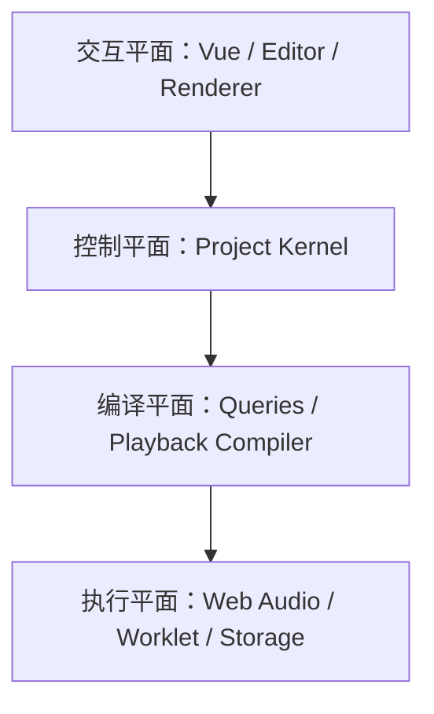
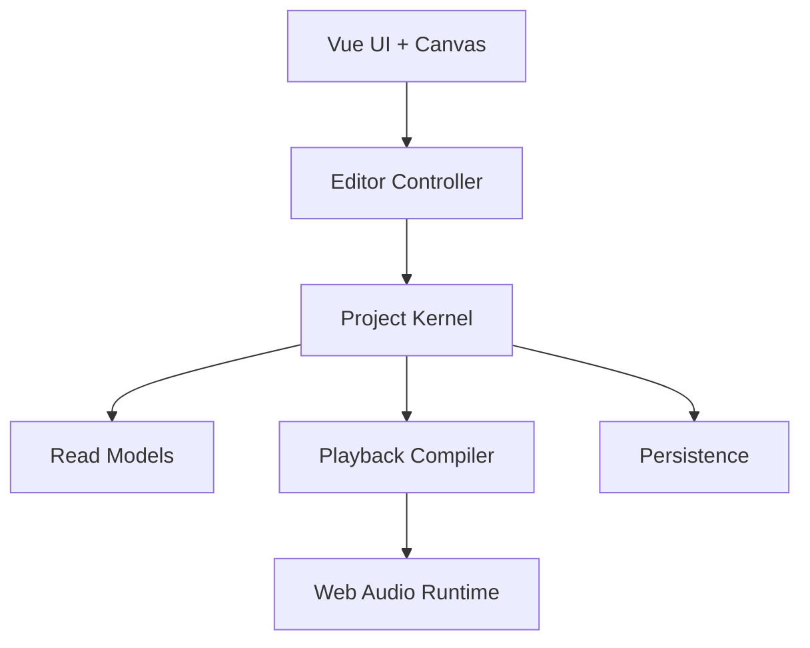
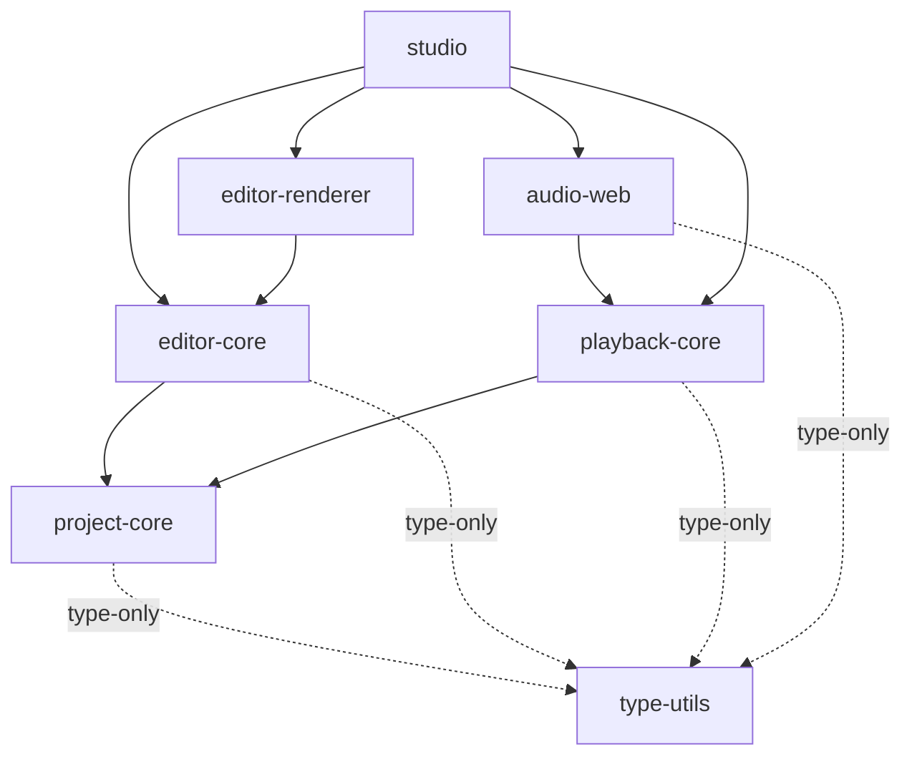
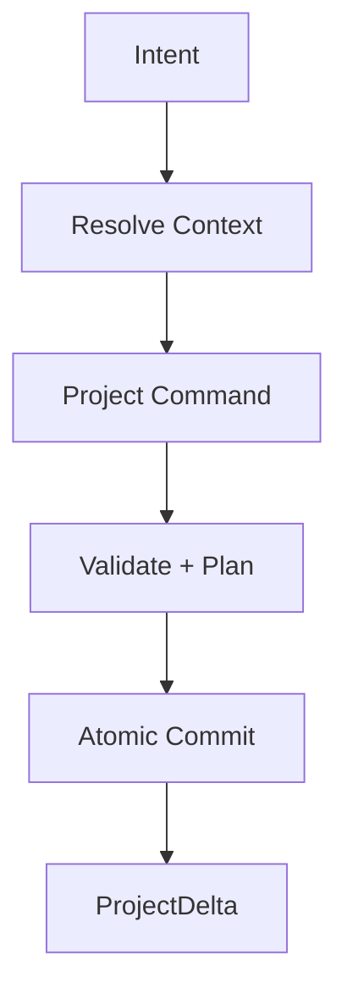

# Web DAW 长期路线与架构设计 v3

> 技术基线：Vue 3 + TypeScript + Vite + Web Audio API + pnpm Workspace\
> 产品目标：桌面浏览器优先、接近 BandLab 创作闭环的轻量 Web DAW\
> 文档角色：架构宪法、模块边界、关键语义、验证标准与迁移路线\
> 评审日期：2026-07-09\
> 状态：Proposed Architecture Baseline v3

---

## 0. 结论先行

v2 的总体方向是正确的，尤其应继续保留：

- ProjectDocument 是项目事实源；
- UI、编辑器、播放编译器与音频运行时分离；
- Vue 不深度代理完整项目；
- Transport、Scheduler、Graph 与项目模型由自己掌控；
- Tone.js 不成为核心架构；
- 事务产生增量变更，重写采用纵向切片；
- IndexedDB、OPFS、Worker 与 AudioWorklet 只作为平台实现。

v3 不推翻这些原则，而是补上会直接决定重写成败的硬契约：

| v2 的模糊点                          | v3 的确定性决策                                                                                             |
| -------------------------------- | ----------------------------------------------------------------------------------------------------- |
| ProjectSession 容易成为总管一切的对象       | ProjectSession 仅作门面，内部拆成 Command Processor、Model Store、History、Query Index、Durability 与 Playback Sync |
| ProjectDocument 同时像存储格式和运行时模型    | 持久化 DTO、内存模型、派生索引和运行时计划分离                                                                             |
| ChangeSet 只有 changed IDs 和 flags | 改为类型化 ProjectDelta，携带实体、轨道、时间区间和失效原因                                                                  |
| Content Lane 的产品语义尚未确定           | V1 不引入通用内容 Lane；Clip 直接属于 Track，Take Lane / Comping 在真正实现时加入                                          |
| AudioClip 同时保存 Tick 长度和秒长度       | V1 明确“起点按音乐时间、素材按原速绝对时长”，避免两个权威长度                                                                     |
| 一个 revision 同时承担编辑、保存、引擎与云版本     | 分离 modelRevision、journalSequence、engineGeneration 与 cloudVersion                                      |
| look-ahead 只描述主线程定时器             | 改为规划层 + 执行层的两级调度，原生节点和 Worklet 分别执行                                                                   |
| 录音可用 MediaRecorder 兜底            | DAW 主录音路径使用 AudioWorklet PCM；MediaRecorder 只适合低保真降级                                                   |
| IndexedDB + OPFS 被视为一个原子存储       | 明确二者不能跨存储原子提交，采用“先完成 Blob，再提交 Manifest 引用”的协议                                                         |
| 全局 revision 驱动 Vue 查询            | 改为按主题或实体订阅，避免每次事务让所有 selector 重算                                                                      |

最终架构可概括为：

```text
Project Model：用户创作事实
Project Kernel：事务、一致性、历史和查询
Editor System：把输入解释为一次可提交的编辑
Playback Core：把项目增量编译为图计划与时间事件
Web Audio Backend：执行图变更、调度、DSP、录音和导出
Browser Infrastructure：存储、文件、Worker、权限和设备
Vue Studio：界面与组合根
```

---

# 第一部分：目标与非目标

## 1. 产品边界

第一阶段的产品闭环为：

```text
创建项目
创建 Instrument / Audio Track
钢琴卷帘编辑 MIDI
导入、裁剪、移动和循环 Audio Clip
播放、暂停、定位和循环
基础乐器、鼓机、效果器与混音
撤销重做
可靠保存、恢复与项目打包
WAV 导出
```

后续阶段再加入：

```text
音频录音
Automation
Send / Return
云端版本保存与分享
评论与 Presence
```

明确不作为当前架构驱动力：

```text
VST / AU 宿主
任意插件 SDK
专业级插件延迟补偿
高级 Warp / Elastic Audio
Comping / Take 管理
实时多人 CRDT
视频、Surround、Atmos
完整移动端编辑
```

长期架构要允许这些能力被加入，但不为尚不存在的产品语义预建一套空泛模型。

## 2. 设计预算

V1 以真实上限而不是“无限扩展”为目标：

| 指标        | 目标预算                                              |
| --------- | ------------------------------------------------- |
| 项目时长      | 15 分钟常规，30 分钟压力测试                                 |
| Track     | 32 常规，64 压力测试                                     |
| Clip      | 1,000 级                                           |
| MIDI Note | 100,000 级压力数据集                                    |
| 同时可见图元    | 10,000 级，超出后必须裁剪                                  |
| 编辑响应      | 常规操作主线程 P95 小于 16 ms                              |
| 拖拽 / 缩放   | 目标 60 FPS，不因提交事务逐帧改项目                             |
| Scheduler | 不重复、不漏发；漂移可观测                                     |
| 保存        | 提交后快速进入 journal 队列，明确显示 dirty / saved             |
| 恢复        | 任意完整 snapshot + 连续 journal 可恢复到最后一致 modelRevision |

这些是测试数据集和性能门槛，不是产品宣传承诺。每个阶段都必须以基准项目验证。

## 3. 能力等级代替浏览器品牌等级

不要把“Chromium / Safari / Firefox”写成业务判断。启动时由 Capability Probe 生成能力画像：

```ts
interface RuntimeCapabilities {
  secureContext: boolean
  webAudio: boolean
  audioWorklet: boolean
  offlineAudio: boolean
  mediaDevices: boolean
  opfs: boolean
  syncAccessHandle: boolean
  sharedArrayBuffer: boolean
  crossOriginIsolated: boolean
  webMidi: boolean
  fileSystemPicker: boolean
  webCodecsAudio: boolean
}
```

产品能力按组合开放：

| Profile      | 必需能力                                    | 产品行为                         |
| ------------ | --------------------------------------- | ---------------------------- |
| Edit         | Canvas、IndexedDB                        | 项目编辑与保存                      |
| Playback     | Web Audio                               | 基础播放                         |
| Full Audio   | AudioWorklet                            | 自定义 DSP、Meter、可靠 PCM Capture |
| Enhanced IPC | crossOriginIsolated + SharedArrayBuffer | 环形缓冲区、低开销实时消息                |
| Recording    | MediaDevices + AudioWorklet             | 正式录音                         |
| Optional I/O | Web MIDI / File Picker                  | 有则启用，无则隐藏或使用 fallback        |

SharedArrayBuffer 是优化路径，不得成为项目可打开、可保存或基础播放的正确性前提。

---

# 第二部分：架构原则与状态所有权

## 4. 七条不可破坏的规则

1. **项目事实只有一份**：ProjectModel 是内存中的权威创作状态。
2. **运行时不是事实源**：AudioNode、Voice、AudioBuffer 与 Meter 都可重建。
3. **用户动作原子提交**：一次动作要么全部成功，要么完全不改变模型。
4. **实时路径只接收编译结果**：AudioWorklet 不读取项目对象，不解释领域命令。
5. **平台依赖向内实现端口**：核心包不 import Vue、DOM、IndexedDB 或 Web Audio。
6. **所有缓存都可丢弃重建**：索引、波形、解码 PCM 与 RuntimePlan 不进入项目格式。
7. **降级必须显式**：能力不足时禁用功能并说明原因，不在运行中静默换语义。

## 5. 状态分类

| 状态                                | 所有者                     | 是否持久化 | 是否 Undo       |
| --------------------------------- | ----------------------- | ----- | ------------- |
| Track、Clip、Note、Tempo、Device 描述   | ProjectModel            | 是     | 是             |
| Selection、焦点、当前 Tool              | EditorSession           | 否     | 通常否           |
| Zoom、Scroll、Panel Layout          | ViewState / Preferences | 可选    | 否             |
| Drag Preview、Box Selection        | InteractionState        | 否     | 否             |
| Transport、Active Voice、Graph Node | Audio Runtime           | 否     | 否             |
| Query Index、Timeline Index        | Derived Cache           | 否     | 否             |
| 原始音频 Blob                         | Asset Store             | 是     | 由引用事务管理       |
| 解码 PCM、Waveform Peaks             | Cache                   | 可重建   | 否             |
| Undo Stack                        | History Controller      | 默认会话级 | 不适用           |
| Journal                           | Durability Layer        | 是     | 用于恢复，不等于 Undo |

Undo、Autosave Journal 和云端变更记录不是同一个概念，不能复用一条未经设计的 patch 流来承担三种职责。

## 6. 四个平面



- **交互平面**处理用户输入、临时预览和绘制。
- **控制平面**验证并原子提交项目事务。
- **编译平面**把项目事实变成 UI Read Model、GraphPlan 和 TimelinePlan。
- **执行平面**与浏览器资源交互，允许失败、重试和降级。

依赖只能从外向内引用稳定契约；通知与结果通过端口返回，不能用跨层对象引用偷渡。

---

# 第三部分：系统总览与工程边界

## 7. 顶层数据流



完整链路：

```text
DOM / Pointer / Keyboard / MIDI
-> EditorIntent
-> Tool Interaction State Machine
-> 完整参数的 ProjectCommand
-> ProjectKernel.commit()
-> ProjectCommit(modelRevision + ProjectDelta)
   -> QueryIndex 增量更新
   -> History 记录
   -> Journal 排队
   -> PlaybackCompiler 编译
-> RuntimeDelta(engineGeneration)
-> WebAudioRuntime 应用并 ACK
```

Project commit 不等待音频设备或磁盘 I/O。外部执行失败不能回滚已经合法的创作事实，但必须进入可观测的 pending / degraded / failed 状态。

## 8. Monorepo 结构

继续使用 pnpm Workspace，初期不上 Turborepo。采用“模块化单体 + 少量硬边界包”：

```text
web-daw/
├── apps/
│   └── studio/                    Vue 3 应用与 Composition Root
├── packages/
│   ├── type-utils/                纯编译期、跨领域 TypeScript 类型工具
│   ├── project-core/              模型、时间、命令、事务、历史、查询端口
│   ├── editor-core/               Tool、Interaction、Selection、Snap、Clipboard
│   ├── playback-core/             Compiler、Transport、Scheduler 契约、RuntimePlan
│   ├── audio-web/                 Web Audio 图、设备、Worklet、录音、离线渲染
│   ├── browser-infra/             IndexedDB、OPFS、文件、权限、Worker、资产实现
│   └── editor-renderer/           Canvas、Viewport、DisplayList、Hit Test
├── tooling/
│   ├── eslint-config/
│   ├── tsconfig/
│   └── architecture-rules/
└── docs/
    └── adr/
```

### 8.1 包依赖



browser-infra 由 studio 组合根注入各核心端口。它可以 import 端口类型，但任何核心包都不能 import browser-infra。

### 8.2 拆包规则

只有同时满足以下条件才新建 package：

- 有清晰、稳定的依赖方向；
- 可以单独测试且不需要应用全局；
- 至少两个上层模块需要它，或它必须隔离平台代码；
- 拆分后不会产生大量双向 DTO 与 re-export。

禁止建立 shared、utils、common 这类无语义收容包。共享代码必须有领域名称和所有者。`type-utils` 只拥有不产生运行时代码、与业务领域无关且经过实际复用验证的 TypeScript 类型代数，不是该规则的例外收容箱。

### 8.3 边界执行

架构规则必须由工具检查，而不是只写在文档中：

```text
project-core 禁止 vue、pinia、web-audio、DOM、IndexedDB imports
editor-core 禁止 vue、web-audio imports
playback-core 禁止 Vue、DOM、具体 AudioNode imports
audio-web 禁止 import editor-core
所有 Worklet 入口禁止 import 应用层和持久化层
包之间禁止绕过 public entry 引用内部路径
```

---

# 第四部分：Project Model

## 9. 持久化 DTO 与内存模型分离

v2 把 ProjectDocument 同时当成文件格式和运行时对象。v3 将边界拆开：

```text
ProjectFileDTO
  外部、不可信、版本化、运行时校验
      |
      v  migrate + validate + normalize
ProjectModel
  内存中的权威事实，保持不变量
      |
      +--> QueryIndex / EditorReadModel
      +--> PlaybackModel / RuntimePlan
```

ProjectFileDTO 可以为了兼容与可迁移保留字段；ProjectModel 可以为高频编辑采用实体表和结构共享。两者不要求对象结构完全相同。

```ts
interface ProjectFileDTO {
  formatVersion: number
  projectId: ProjectId
  metadata: ProjectMetadataDTO
  requiredFeatures: readonly FeatureId[]

  timeline: TimelineDTO
  trackOrder: readonly TrackId[]
  tracks: Record<TrackId, TrackDTO>
  clips: Record<ClipId, ClipDTO>
  midiSources: Record<MidiSourceId, MidiSourceDTO>
  automationLanes: Record<AutomationLaneId, AutomationLaneDTO>
  devices: Record<DeviceId, DeviceDTO>
  master: MasterChannelDTO
  assetManifest: Record<AssetId, AssetRefDTO>
}
```

外部数据永远经过：

```text
parse
-> schema validate
-> ordered migrations
-> semantic validate
-> normalize
-> create ProjectModel
```

不能把 JSON parse 的结果直接 cast 成 TypeScript 类型。

## 10. 实体身份与集合

- ID 是不可变 opaque string，不含数组位置或父级路径。
- 有序关系使用 ID 数组；实体内容使用表。
- 所有时间区间统一采用半开区间 [start, end)。
- 运行时禁止用数组下标作为 Note、Clip 或 Automation Point 身份。
- 删除父实体必须通过命令处理其子引用，不能依赖垃圾对象自然消失。

V1 不引入通用 ContentLane。Clip 直接包含 trackId，派生索引维护 track -> clips。

原因：

- 当前没有明确的 Take / Comping 产品语义；
- “每轨默认一条 Lane”只增加一层 ID、命令和索引；
- Automation Lane 与内容轨道的行为不同，仍应独立存在；
- 真正实现 Take Lane 时，通过 schema migration 增加 laneId，而不是提前承担空抽象。

## 11. Track 是信号拓扑，不是 UI 分类继承树

```ts
interface Track {
  id: TrackId
  name: string
  color?: string
  source: TrackSource
  midiEffectIds: readonly DeviceId[]
  audioEffectIds: readonly DeviceId[]
  channel: ChannelStripDescriptor
}

type TrackSource =
  | { kind: 'audio'; recordingInput?: LogicalInputConfig }
  | { kind: 'instrument'; instrumentDeviceId: DeviceId }
```

Drum、Bass、Vocal 是 Track Template、编辑器显示偏好或设备预设，不是新的领域子类。

LogicalInputConfig 只描述声道选择等可移植配置；浏览器暴露的物理 deviceId 和权限状态属于本机偏好 / RecordingSession，不进入共享项目文件。

合法拓扑由验证器保证：

```text
Audio Track:
  Audio Clips / Input -> Audio FX -> Channel Strip

Instrument Track:
  MIDI Clips / MIDI Input -> MIDI FX -> Instrument -> Audio FX -> Channel Strip
```

V1 路由固定为 Track -> Master。Send / Return 加入后使用受约束的 OutputRoute 与 SendRoute，不直接开放任意 AudioNode 图。路由图必须无非法环，并有明确的 Solo、Mute、Pre/Post Fader 语义。

## 12. MIDI Clip 与 MIDI Source

```ts
interface MidiClip {
  id: ClipId
  kind: 'midi'
  trackId: TrackId
  startTick: Tick
  spanTick: Tick
  sourceId: MidiSourceId
  sourceOffsetTick: Tick
  loop?: MidiLoop
}

interface MidiSource {
  id: MidiSourceId
  lengthTick: Tick
  notes: Record<NoteId, MidiNote>
  controllers: readonly MidiControllerEvent[]
}
```

Clip 是时间线窗口，Source 是相对时间内容。V1 规定每个 MidiSource 只有一个 Clip 所有者；Duplicate 时深拷贝 Source 并生成新 ID。

不要在 V1 暗中允许多个 Clip 共享 Source，否则编辑一个 Clip 是否修改其他 Clip 会变成未定义行为。Linked Clip 必须作为独立功能加入，不能由偶然共享引用产生。

## 13. Audio Clip 的时间语义

这是 v2 最需要补充的领域决策。

V1 不支持 Warp，采用：

```text
Clip 起点：音乐时间 Tick
素材区间：整数微秒 MediaTimeUs
播放速度：原速 rate = 1
时间线终点：由 TempoMap(startTick) + sourceDurationUs 推导
```

```ts
interface AudioClip {
  id: ClipId
  kind: 'audio'
  trackId: TrackId
  startTick: Tick
  assetId: AssetId
  sourceRange: {
    startUs: MediaTimeUs
    durationUs: MediaTimeUs
  }
  gainDb: Decibel
  fades?: ClipFades
  playback: {
    mode: 'fixed'
    rate: 1
  }
  placement:
    | { kind: 'one-shot' }
    | { kind: 'looped'; spanTick: Tick }
}
```

因此：

- one-shot 的时间线终点由 startTick 对应的项目秒加上 sourceRange.durationUs 推导；
- looped 的 sourceRange 以原始绝对时长重复，spanTick 只表示编排窗口，并不是 sourceRange 的第二种长度；
- 改变项目 Tempo 会改变 one-shot 在小节网格上的视觉终点，但不会变调或拉伸素材；
- looped 的编排终点保持在 startTick + spanTick；Tempo 改变后源循环仍按原始时长重复，因此可能不再与拍点对齐；
- Trim 命令改变 sourceRange，而不是同时维护一个 durationTick；
- Split 先把切割 Tick 转成项目秒，再转成素材微秒；
- 所有转换都使用统一 rounding policy；
- Repitch 和 Warp 在各自语义确定后以新的 playback union variant 加入。

如果产品最终希望音频 Clip 的起点和终点都锁定在网格，则必须另建 musical / warped 模式，不能让 fixed 模式同时保存相互冲突的秒长度和 Tick 长度。

## 14. 时间系统

建议固定项目 PPQ 为 960；MIDI 导入时转换，不在每个项目中保留任意 PPQ。

```ts
type Tick = number & { readonly brand: 'Tick' }
type ProjectSecond = number & { readonly brand: 'ProjectSecond' }
type AudioContextTime = number & { readonly brand: 'AudioContextTime' }
type MediaTimeUs = number & { readonly brand: 'MediaTimeUs' }
type AudioFrame = number & { readonly brand: 'AudioFrame' }
type CssPixel = number & { readonly brand: 'CssPixel' }
```

规则：

- Tick、MediaTimeUs、AudioFrame 必须为安全整数；
- ProjectSecond 和 AudioContextTime 只在编译与运行时边界使用浮点；
- V1 Tempo 只支持 step change，不支持 tempo ramp；
- TempoMap 在每个 tempo segment 缓存累计秒数；
- 第 0 Tick 必须存在 Tempo 与 Time Signature；
- 所有 range 使用 [start, end)；
- start 转换默认 floor，end 转换默认 ceil，网格吸附使用 nearest；
- Tick -> Second -> Tick 的误差与舍入必须通过属性测试定义。

## 15. Automation 与参数地址

参数不能只用可选 deviceId + parameterId 表达：

```ts
type ParameterAddress =
  | {
      scope: 'track'
      trackId: TrackId
      parameter: 'volume' | 'pan'
    }
  | {
      scope: 'device'
      deviceId: DeviceId
      parameterId: ParameterId
    }

interface AutomationLane {
  id: AutomationLaneId
  target: ParameterAddress
  enabled: boolean
  points: Record<AutomationPointId, AutomationPoint>
  order: readonly AutomationPointId[]
}
```

Parameter Definition 决定：

```text
值类型与合法范围
显示单位和映射
默认值
是否可自动化
a-rate / k-rate / event-rate
允许的曲线：hold / linear / exponential
```

通用连续参数建议把 automation 保存为规范化值 0..1，设备定义负责稳定映射；离散参数只能用 hold。Track Volume / Pan 可以使用项目定义的固定映射。

## 16. Device 描述与缺失设备

```ts
interface DeviceDescriptor {
  id: DeviceId
  typeId: DeviceTypeId
  definitionVersion: number
  enabled: boolean
  parameters: Record<ParameterId, JsonValue>
  opaqueState?: JsonValue
}
```

Device Definition 必须声明：

```text
输入 / 输出端口类型
参数 schema 和稳定 ID
实时与离线渲染能力
已知 latencyFrames
tailTime
是否支持 sample-accurate automation
state migration
runtime factory
```

加载项目时找不到设备实现：

- 保留原始 descriptor 和 opaque state；
- 插入 MissingDevice 占位；
- 默认 bypass 或 silence 由设备类别决定；
- UI 清晰提示；
- 保存时不得丢失未知状态。

Tone.js、第三方 DSP 或未来 WAM 只能通过 Device Adapter 接入。项目文件绝不保存 Tone 对象、AudioNode 类型名或第三方实例结构。

---

# 第五部分：Project Kernel 与编辑事务

## 17. ProjectSession 只作为门面

对 UI 暴露的 API 可以继续叫 ProjectSession，但内部不得堆成一个巨型类：

```ts
interface ProjectSession {
  getSnapshot(): ProjectSnapshot
  execute(command: ProjectCommand): ProjectCommit
  undo(): ProjectCommit | null
  redo(): ProjectCommit | null
  query<T>(query: ProjectQuery<T>): T
  subscribe(filter: ProjectSubscription, listener: Listener): Unsubscribe
}
```

内部组件：

| 组件                    | 单一职责                                |
| --------------------- | ----------------------------------- |
| CommandProcessor      | 路由命令、校验 baseRevision、执行 handler     |
| ModelStore            | 持有当前 immutable root 与 modelRevision |
| InvariantValidator    | 提交前验证跨实体不变量                         |
| HistoryController     | Undo / Redo、合并策略                    |
| QueryIndex            | 可重建索引与 selector 依赖                  |
| ChangePublisher       | 发布 ProjectCommit                    |
| DurabilityCoordinator | Journal / snapshot 状态，不直接写浏览器 API   |
| PlaybackSync          | 将 ProjectDelta 交给 compiler 并跟踪 ACK  |

## 18. 命令与提交管线

分清四种概念：

```text
EditorIntent       delete-selection
ProjectCommand     remove-clips(clipIds, baseRevision)
MutationPlan       经过验证的类型化实体变化
ProjectCommit      新模型 + modelRevision + delta + history metadata
```



提交规则：

- Command 必须带完整实体 ID，不读取 Selection；
- 可选 baseRevision 防止基于陈旧预览提交；
- 所有子操作先生成 MutationPlan，全部验证后一次应用；
- 提交只增加一次 modelRevision；
- 一次用户动作只产生一个 History Entry；
- 外部副作用在 commit 之后异步执行；
- handler 不直接调用 AudioRuntime、IndexedDB 或 Vue。

## 19. 类型化 ProjectDelta

通用 changedEntityIds 无法告诉播放编译器“哪条轨、哪个区间、为何失效”。使用语义明确的变化：

```ts
interface ProjectDelta {
  transactionId: TransactionId
  modelRevision: number
  changes: readonly ProjectChange[]
  invalidations: {
    queries: readonly QueryInvalidation[]
    timeline: readonly TimelineInvalidation[]
    graph: readonly GraphInvalidation[]
    assets: readonly AssetReferenceChange[]
  }
}

type ProjectChange =
  | { type: 'clip-added'; clipId: ClipId; trackId: TrackId }
  | { type: 'clip-removed'; clipId: ClipId; trackId: TrackId }
  | { type: 'clip-range-changed'; clipId: ClipId; before: TickRange; after: TickRange }
  | { type: 'notes-changed'; sourceId: MidiSourceId; affected: TickRange }
  | { type: 'tempo-map-changed'; affectedFrom: Tick }
  | { type: 'device-chain-changed'; trackId: TrackId }
  | { type: 'parameter-changed'; target: ParameterAddress }
```

ProjectDelta 是提交结果，不是项目真相，也不是永久事件溯源日志。它可以被丢弃和重新从 snapshot 全量编译。

## 20. 四种版本号

| 名称               | 所有者              | 用途                   |
| ---------------- | ---------------- | -------------------- |
| modelRevision    | Project Kernel   | 每次本地原子提交递增           |
| journalSequence  | Persistence      | 判断 journal 连续性与恢复顺序  |
| engineGeneration | Playback / Audio | 丢弃过期编译结果和 Worklet 事件 |
| cloudVersion     | Cloud Repository | 乐观并发、冲突与同步           |

禁止把它们都叫 revision。engineGeneration 落后于 modelRevision 是合法的短暂状态；UI 应能显示 Audio Sync pending 或 failed。

## 21. History

History 保存可逆、类型化的 MutationPlan 或其 inverse，而不是长期依赖任意 JSON path：

```ts
interface HistoryEntry {
  id: HistoryEntryId
  label: string
  forward: readonly ProjectMutation[]
  inverse: readonly ProjectMutation[]
  mergeKey?: string
  editorBefore?: EditorRestorePoint
  editorAfter?: EditorRestorePoint
}
```

策略：

- pointermove 只更新 Interaction Preview，pointerup 提交一次；
- 连续旋钮按 gesture 合并，不按任意时间猜测；
- 文本编辑在 focus session 结束时合并；
- Undo / Redo 仍走完整不变量检查与 ProjectCommit；
- EditorRestorePoint 只恢复选择与焦点，不进入 ProjectModel；
- 新的普通提交清空 redo 分支；
- Undo history 默认不写入项目文件，崩溃恢复依靠 journal。

## 22. Query Index 与订阅

建议维护：

```text
trackId -> ordered clips
time range -> clips
sourceId + tick/pitch range -> notes
parameter address -> automation lane
assetId -> referencing entities
trackId -> device / routing summary
```

索引是可重建缓存，更新失败时可从当前 ProjectModel 重建，不能让模型和索引各自成为真相。

订阅应支持主题和实体过滤：

```ts
session.subscribe(
  { topics: ['arrangement'], trackIds: visibleTrackIds },
  onArrangementChanged
)
```

不要用一个全局 revision ref 让 Mixer、Piano Roll、Inspector 和 Arrangement 在任意 Note 变化后全部重算。

---

# 第六部分：Editor System 与渲染

## 23. 编辑器状态分层

```text
ProjectModel
  可保存、可撤销的创作事实

EditorSession
  selection、focused surface、active tool、internal clipboard

ViewState
  zoom、scroll、viewport、panel layout

InteractionState
  pointer capture、drag origin、preview geometry、snap result

PlaybackView
  从 Audio Runtime 采样得到的 playhead、meter、sync state
```

ProjectModel 的变更频率是“事务级”，InteractionState 和 PlaybackView 的变更频率是“帧级”。二者不得经过同一响应式传播链。

## 24. 输入归一化

DOM Event 先转换成框架无关的 EditorInput：

```ts
type EditorInput =
  | {
      type: 'pointer'
      phase: 'down' | 'move' | 'up' | 'cancel'
      pointerId: number
      point: ClientPoint
      buttons: number
      modifiers: Modifiers
    }
  | {
      type: 'key'
      phase: 'down' | 'up'
      code: string
      modifiers: Modifiers
    }
  | {
      type: 'midi'
      message: MidiInputMessage
    }
```

快捷键解析根据 focused surface、文本输入焦点和 modal scope 生成 EditorIntent。组件不得自行实现一套删除、复制或拖拽语义。

## 25. Surface、坐标与 Hit Test

每个 Surface 提供稳定端口：

```ts
interface EditorSurface {
  id: SurfaceId
  toLocal(point: ClientPoint): LocalPoint
  toDomain(point: LocalPoint): DomainPoint
  hitTest(point: LocalPoint, tolerancePx: CssPixel): HitResult
  collectSnapCandidates(context: SnapContext): readonly SnapCandidate[]
  createReadModel(query: SurfaceQuery): SurfaceReadModel
}
```

坐标链只有一个实现入口：

```text
Client
-> Element Local
-> Viewport
-> Timeline Tick / Track / Pitch / Value
```

所有命中容差、吸附距离和 resize handle 尺寸以 CSS pixel 定义，再通过当前缩放转换。不能用固定 Tick 当作鼠标容差。

## 26. Tool 是显式交互状态机

最小状态：

```text
Idle
-> Pressed
-> Dragging
-> Committing
-> Idle

任意活动状态
-> Cancelled
-> Idle
```

每次 interaction 必须定义：

- 启动条件和 pointer capture；
- 初始 modelRevision；
- 临时预览数据；
- Snap 与约束；
- pointerup 生成的唯一 Command；
- Escape、pointercancel、失焦和实体被删除时的取消行为；
- 模型在拖拽中被其他操作修改时，是 rebase 还是 cancel。

V1 建议采用简单规则：若 interaction 依赖的实体在 baseRevision 之后被修改或删除，取消手势并提示，而不是尝试隐式 rebase。

## 27. Selection、Clipboard 与 Preview

Selection 只保存稳定引用：

```ts
type SelectionRef =
  | { kind: 'track'; id: TrackId }
  | { kind: 'clip'; id: ClipId }
  | { kind: 'note'; sourceId: MidiSourceId; id: NoteId }
  | { kind: 'automation-point'; laneId: AutomationLaneId; id: AutomationPointId }
  | { kind: 'device'; id: DeviceId }
```

需要固定以下语义：

- 每个 Surface 是否允许混合选择；
- primary、anchor 和 focus 的区别；
- 删除实体后如何清理引用；
- Undo / Redo 后如何恢复 EditorRestorePoint；
- 切换项目时 Selection 必须清空。

Clipboard Payload 独立于原项目 ID。Paste 时生成新 ID、验证目标 Track 能力、重新绑定 Asset 引用，并以一次事务提交。

Preview Playback、Drag Ghost、Box Selection 都不修改项目、不进入 History、不触发 Autosave。

## 28. Canvas 渲染架构

继续采用 DOM + Canvas 2D：

| DOM                            | Canvas                           |
| ------------------------------ | -------------------------------- |
| App Shell、Toolbar、Track Header | Grid、Clip、Waveform               |
| Inspector、Menu、Dialog          | Piano Roll Note                  |
| Mixer 与 Device Controls        | Automation Curve                 |
| 可访问性输入和语义摘要                    | Selection、Ghost、Playhead Overlay |

Renderer 内部：

```text
Viewport Controller
Read Model Adapter
Display List
Spatial Index
Layer Cache
Dirty Region Tracker
Frame Scheduler
```

推荐图层：

```text
Static Grid
Content
Selection
Interaction Preview
Playhead
Tooltip / Cursor
```

规则：

- 只查询可见 Track 与时间范围；
- Waveform 使用多分辨率 peaks，不逐帧扫描 PCM；
- Playhead 与 Meter 不使 Content Layer 重绘；
- Track Header DOM 做纵向虚拟化；
- DPR 与 resize 由 Renderer 统一处理，领域层只使用 CSS pixel；
- OffscreenCanvas / Worker Renderer 是 profiling 后的升级项，不作为 V1 前提。

Canvas Surface 仍要提供键盘操作、可聚焦容器、当前选择的语义摘要和 Inspector 精确编辑入口。

## 29. Vue 3 集成

Vue 负责组件、布局和低中频 UI；ProjectSession、Renderer 与 AudioRuntime 都是外部状态系统：

```text
Pinia
  用户偏好、面板、模态框、EditorSession 的轻量状态

ProjectSession
  markRaw 门面，通过 useProjectSelector 订阅局部数据

Renderer / AudioRuntime
  markRaw 服务，通过生命周期显式 dispose

Playhead / Meter
  requestAnimationFrame 读取只读快照
```

推荐建立统一适配器：

```ts
function useProjectSelector<T>(
  selector: ProjectSelector<T>,
  equality: (a: T, b: T) => boolean
): ShallowRef<T>
```

selector 声明依赖 topic / entity，ProjectDelta 只通知相关订阅者。返回结果优先使用不可变对象或稳定引用；Vue 使用 shallowRef，不把十万 Note 变成 Proxy。

Pinia 禁止保存：

```text
完整 ProjectModel
AudioContext / AudioNode
AudioBuffer / PCM
Renderer Display List
每帧 Meter sample
每次 pointermove 的领域副本
```

---

# 第七部分：Playback Core

## 30. 编译边界

Audio Runtime 不读取 ProjectModel。PlaybackCompiler 只输出浏览器无关的计划：

```text
ProjectSnapshot + ProjectDelta
-> Playback Model
-> GraphPlan
-> TimelineIndex
-> AutomationPlan
-> RuntimeDelta
```

```ts
interface RuntimeDelta {
  modelRevision: number
  engineGeneration: number
  graphOps: readonly GraphOperation[]
  timelineInvalidations: readonly RuntimeRangeInvalidation[]
  parameterOps: readonly RuntimeParameterOperation[]
}
```

Playback Core 负责解释：

```text
Track 拓扑
Clip 窗口与循环
MIDI Note 展开
TempoMap
Automation
Mute / Solo 逻辑状态
```

audio-web 只负责把计划映射到 Web Audio 资源。

## 31. Transport 与时钟

调度的权威时钟是 AudioContext.currentTime。performance.now 不能用来决定声音何时开始，只用于 UI 与诊断。

```ts
interface TransportMapping {
  state: 'stopped' | 'playing' | 'paused' | 'recording'
  engineGeneration: number
  anchorTick: Tick
  anchorContextTime: AudioContextTime
  loop?: TickRange
}
```

集中实现：

```text
Tick <-> ProjectSecond
ProjectSecond <-> AudioContextTime
Tick <-> AudioContextTime
AudioContextTime -> UI Output Time
```

播放头显示可用 getOutputTimestamp 与可用的 latency 信息做视觉补偿，但这些估计不改变调度时间。

必须以 ADR 固定：

- Play 从 cursor 还是 selection start；
- Pause 保留位置；
- Stop 回到启动点还是 0；
- Loop 使用半开区间 [start, end)；
- Loop 末尾 Note Off 与下一轮 Note On 的顺序；
- Seek 后旧事件如何失效；
- Tempo change 从哪个边界生效；
- 浏览器 suspend / resume 后是否继续或暂停。

## 32. 两级 Scheduler

单一 setInterval look-ahead 不足以描述 DAW 执行模型。

### 32.1 规划层

运行在控制线程，职责：

```text
根据 TransportMapping 计算下一调度窗口
从 TimelineIndex 查询事件
展开 Clip Loop
生成稳定 EventKey
把 Tick 转成 AudioContextTime
批量交给执行层
维护 horizon、drift 与 generation
```

唤醒可由主线程 timer 或辅助 Worker 触发，但二者都不是实时保证。正确性来自提前排程和恢复策略，不来自假设 timer 准时。

### 32.2 执行层

两类后端：

| 事件类型                                    | 执行方式                                                               |
| --------------------------------------- | ------------------------------------------------------------------ |
| AudioBufferSource、Oscillator、AudioParam | 在主线程提前调用 start / stop / automation，Web Audio 渲染线程按 context time 执行 |
| 自定义 Sampler、Synth、DSP                   | 批量发送带目标 AudioFrame 的事件到 AudioWorklet 队列                            |

AudioWorklet 通信默认使用 MessagePort + 批量 DTO；跨源隔离可用时升级为 SharedArrayBuffer ring buffer。两条路径必须共享相同的 generation、EventKey 和测试向量。

```ts
interface ScheduledRuntimeEvent {
  eventKey: EventKey
  engineGeneration: number
  targetFrame: AudioFrame
  kind: RuntimeEventKind
  payload: RuntimeEventPayload
}
```

Worklet 收到旧 generation 事件直接丢弃。队列不足、迟到事件与 underrun 必须计数，不能静默处理。

### 32.3 自适应窗口

初始 horizon 可以从保守值开始，再根据：

```text
主线程长任务
消息传递延迟
AudioContext latency
设备性能
实际 late event 数
```

自适应调整。具体毫秒值由 benchmark 决定，不写死为架构真理。

## 33. 播放中编辑语义

| 变化位置 / 类型               | V1 策略                                     |
| ----------------------- | ----------------------------------------- |
| 调度窗口之外                  | 新 generation 正常编译                         |
| 已调度但尚未开始的 Note / Source | cancel 或 stop 后按新计划重建                     |
| 正在发声的 Note 被移动          | 当前 voice 快速 release，不在新位置补触发过去事件          |
| 正在发声的 Note 被删除          | 快速 release                                |
| 改变未来 Note velocity      | 取消旧事件并重建                                  |
| 改变当前 Clip gain          | 短 ramp 到新值，避免 click                       |
| 改变 Tempo                | 从安全锚点重建 Transport mapping 与未来窗口           |
| Seek                    | generation + 1、取消未来事件、allNotesOff、从新位置预滚动 |
| Track / Device 删除       | 先停止其 voice，再淡出和 dispose 图节点               |

“保留当前声部还是立即反映编辑”必须按操作定义，不允许每个设备自行猜测。

## 34. Graph Compiler 与 Reconciler

GraphPlan 描述稳定长生命周期节点：

```text
Track Source / Instrument
-> MIDI / Audio Device Chain
-> Clip / Track Gain
-> Fader
-> Pan
-> Meter
-> Output
-> Master
```

Graph Reconciler 接收：

```text
create
connect
set parameter
bypass
reconnect
dispose
```

规则：

- 参数更新优先 ramp，不直接跳值；
- 替换效果器时使用短交叉淡化或安全边界，避免 click；
- AudioBufferSourceNode 是一次性 Voice，不属于持久 Graph；
- 断开连接后仍要解除 listener、MessagePort 和缓存引用；
- Track runtime、Device runtime 与 Voice 分别有状态机；
- dispose 必须幂等；
- 切换项目或 AudioContext close 前执行全局 allNotesOff 与资源统计归零。

## 35. Device Runtime

```ts
interface RealtimeDeviceRuntime {
  readonly input?: AudioNode
  readonly output?: AudioNode
  applyState(state: DeviceStatePatch, at: AudioContextTime): void
  getLatencyFrames(): number
  getTailTime(): number
  dispose(): void
}

interface InstrumentRuntime extends RealtimeDeviceRuntime {
  enqueue(events: readonly ScheduledRuntimeEvent[]): void
  allNotesOff(at: AudioContextTime): void
}
```

V1 内置设备限制为零延迟或已知固定延迟。没有实现 Plugin Delay Compensation 前，不允许加入需要隐式前视却不报告 latency 的设备。

技术策略：

```text
Transport、Compiler、Scheduler、Graph、Mixer：自研
基础 Gain / Pan / Filter / Dynamics：优先原生 Web Audio Node
Sampler / Synth / Meter / PCM Capture：AudioWorklet
复杂、可复用 DSP：评估 Rust/C++ -> WebAssembly
Tone.js：只允许原型或叶子 Device Adapter
```

第三方库可以替换实现，不能定义项目时间、设备身份、参数地址、保存格式和 Undo 语义。

## 36. 实时线程规则

AudioWorklet process 路径必须：

- 不访问 DOM、Vue、IndexedDB、网络或项目对象；
- 不做 JSON parse、schema validation 或大对象复制；
- 预分配常用缓冲区，避免每个 render quantum 产生垃圾；
- 使用定长或有界队列并定义 overflow 策略；
- Meter 数据允许降采样和丢帧，Note / Transport 事件不允许无声丢弃；
- 消息协议带 version 与 engineGeneration；
- DSP 异常转成状态码与诊断事件，不在热路径输出大量日志。

所有音频线程协议都必须有纯 TypeScript reference implementation 或测试 harness，以便不依赖真实声卡验证。

## 37. Preview Playback

Preview 使用独立来源标签，但可复用当前 Track Instrument：

```text
Piano Key / Note Drag
-> Preview Service
-> Preview Voice Namespace
-> Instrument Runtime
```

Preview 不进入 Timeline Scheduler；它与主播放用不同 EventKey namespace。切 Track、失焦、关闭面板、Stop 和 AudioContext interruption 时必须清理 preview voices。

同一 pitch 的 preview 与 timeline voice 不能只靠 pitch 做 Note Off，必须使用 voice token，避免误杀另一来源的声音。

---

# 第八部分：Asset、Recording 与 Export

## 38. Asset 身份

区分逻辑身份和内容身份：

```ts
interface AssetReference {
  id: AssetId
  blobHash: ContentHash
  displayName: string
  mediaType: string
  byteLength: number
  durationUs?: MediaTimeUs
  channels?: number
  sourceSampleRate?: number
}
```

- AssetId 是项目引用；
- blobHash 是内容寻址、去重和校验；
- 原始 Blob 是持久资产；
- AudioBuffer / PCM 是按 engine sample rate 生成的缓存；
- Peaks 是按 hash + 算法版本生成的可重建缓存。

## 39. Import Pipeline

```text
用户选择 File
-> 写临时对象
-> 大小 / 类型 / 安全限制
-> 流式 hash
-> metadata / decode probe
-> 完成 content-addressed blob
-> 写 Asset record
-> 最后提交 AddAsset + AddClip 事务
```

ProjectModel 不得引用尚未完成的 Blob。任何一步失败都只留下可清理 temp，不产生损坏 Clip。

解码通过 AudioDecodePort：

```text
首选可验证的浏览器解码能力
decodeAudioData 作为广泛 fallback
WebCodecs AudioDecoder 作为 capability-gated adapter
```

缓存键至少包含：

```text
blobHash
decoderVersion / strategy
targetSampleRate
channelPolicy
```

不能假设 decodeAudioData 保持源采样率；项目中的 sourceRange 因此用媒体时间而不是解码后 AudioBuffer 下标作为唯一持久真相。

## 40. Waveform

Worker 生成多分辨率 min/max peaks pyramid：

```text
level 0：每 N frame 一个 min/max
level 1：聚合前一级
...
```

Renderer 根据像素密度选 level。Peaks 文件包含：

```text
asset hash
算法版本
源时长
channel count
每级 block size
checksum
```

算法升级或校验失败时删除并重建，不迁移缓存。

## 41. Recording

正式录音路径：

```text
getUserMedia
-> MediaStreamAudioSourceNode
-> Monitoring Path
-> PCM Capture AudioWorklet
-> bounded chunk transport
-> Recording Worker
-> OPFS pending file
-> finalize Asset
-> create AudioClip transaction
```

Enhanced IPC 使用 SharedArrayBuffer ring buffer；fallback 使用池化、可转移 Float32Array chunks。MediaRecorder 只作为语音备忘或不保证样本边界的降级功能，不能与正式 DAW Take 使用同一质量标签。

RecordingSession 状态：

```text
idle
-> preparing
-> armed
-> recording
-> finalizing
-> committed

任意活动状态 -> failed / recoverable
```

必须处理：

- 权限拒绝与设备拔出；
- input sample rate 和 AudioContext sample rate；
- 输入、监控与输出延迟；
- 录音起点与 transport frame 对齐；
- 浏览器后台、AudioContext interruption；
- 磁盘配额耗尽；
- finalize 前崩溃后的 pending file 恢复或清理；
- 监听回授提示。

录音设备校准属于用户 / 设备偏好，不写进共享项目事实；最终 Clip 的已补偿起点属于项目事实。

## 42. Offline Export

导出冻结：

```text
ProjectSnapshot(modelRevision)
+ resolved assets
+ Device capability report
+ export settings
```

然后复用 PlaybackCompiler：

```text
PlaybackCompiler
-> Offline GraphPlan / TimelinePlan
-> OfflineAudioContext 或 Device Offline Backend
-> PCM
-> Worker encoder
-> WAV
```

每个 Device 必须明确：

```text
offline-supported
realtime-only
fallback-supported
```

存在 realtime-only 设备时禁止悄悄导出不同声音；要么提示并中止，要么由用户明确选择 bypass / realtime bounce。

导出结果包含 peak 检测、时长、sample rate、channel count 与所用 modelRevision。V1 优先 WAV；有损格式作为独立编码 adapter。

---

# 第九部分：Persistence 与恢复

## 43. 存储职责

| 存储         | 内容                                                 |
| ---------- | -------------------------------------------------- |
| IndexedDB  | 项目元数据、snapshot manifest、journal、asset records、保存状态 |
| OPFS       | 原始音频、大型 pending recording、可选 peaks / PCM cache     |
| Memory LRU | 解码 PCM、Display cache、短期 Playback plan              |
| Cloud      | 后期的 durable copy、版本与分享                             |

浏览器存储可能受配额、清理与用户操作影响。即使申请 persistent storage，也要提供项目 bundle 导出或云备份路径。

## 44. 不能伪造的原子性

IndexedDB transaction 可以原子更新其 object stores，但不能和 OPFS 文件写入组成一个跨系统事务。因此采用引用提交协议：

### 44.1 新资产

```text
1. OPFS 写 temp，并计算长度与 hash
2. flush / close，验证最终内容
3. 以 content hash 标记为 completed blob
4. IndexedDB 单事务写 AssetRecord + Project Journal 引用
5. 后台清理无引用 temp
```

Project Journal 永远只引用 completed blob。

### 44.2 普通编辑

```text
ProjectCommit
-> memory dirty
-> journal queue
-> IndexedDB transaction append entries
-> journalSequence durable
-> debounce snapshot
-> snapshot 成功后更新 checkpoint
-> 按保留策略压缩旧 journal
```

### 44.3 显式保存

显式 Save 等待：

```text
所有待引用 Asset 完成
journal queue flush
最新 snapshot / checkpoint 成功
```

可以对显式保存使用更强 durability hint；高频自动保存根据实测权衡延迟和耐久性。UI 的 Saved 只能在约定的 durability boundary 达成后显示。

## 45. Journal

```ts
interface JournalEntry {
  projectId: ProjectId
  sequence: number
  transactionId: TransactionId
  baseModelRevision: number
  resultModelRevision: number
  mutations: readonly PersistedMutation[]
  checksum: string
  createdAt: string
}
```

规则：

- sequence 连续；
- transactionId 幂等；
- base / result revision 必须相邻；
- entry 自校验；
- replay 每条后运行必要不变量；
- 遇到 gap 或损坏条目时停在最后一致状态并保留诊断副本；
- Journal 格式也有版本，不能假设领域 mutation 永久不变。

## 46. Snapshot、加载与迁移

打开项目：

```text
读取最新有效 Snapshot
-> 校验 checksum
-> 运行 ProjectFileDTO migrations
-> 创建 ProjectModel
-> replay 连续 Journal
-> rebuild Query Index
-> resolve Asset Manifest
-> compile initial Playback Plan
```

Snapshot 写入采用新记录 + checkpoint 指针切换，不原地覆盖唯一好副本。至少保留前一个有效 checkpoint，直到新 checkpoint 验证成功。

迁移必须：

- 每个版本单向、纯函数、可重复；
- 有真实旧项目 golden fixtures；
- 迁移失败不覆盖原文件；
- 未知 requiredFeatures 阻止可写打开，可提供只读检查；
- 新版本保存后明确不支持旧客户端回写。

## 47. 垃圾回收

引用计数只能辅助，不能作为唯一删除依据；崩溃和未完成事务会使计数漂移。

采用 mark-and-sweep：

```text
Roots:
  当前 Project snapshots
  保留的 checkpoints
  未压缩 journal
  pending recording recovery records
  cloud upload queue

Mark blob hashes
-> grace period
-> delete unmarked completed blobs
-> delete expired temp
```

GC 前先检查存储锁，并记录可恢复清单。缓存可以激进删除，原始资产必须保守删除。

## 48. Project Bundle

导出项目包至少包含：

```text
manifest.json
project.json
assets/<content-hash>
checksums.json
```

peaks、decoded PCM 和运行时索引默认不打包。导入时限制文件数、单文件大小、解压总量与路径，防止恶意或损坏 bundle。

---

# 第十部分：线程、协议与平台

## 49. 线程职责

| 执行环境                   | 职责                                                       |
| ---------------------- | -------------------------------------------------------- |
| Main Thread            | Vue、Project Kernel、Editor、Canvas、Web Audio graph control |
| General Worker         | hash、waveform、解析、迁移、WAV 编码、重计算                           |
| Storage Worker         | OPFS SyncAccessHandle、录音文件流                              |
| Audio Rendering Thread | 原生 AudioNode 与 AudioWorklet DSP                          |

不要为了“用了 Worker”而把所有东西异步化。只有 CPU、I/O 或隔离收益明确的任务进入 Worker。

## 50. Worker 协议

每个协议都定义：

```ts
interface ProtocolEnvelope<T> {
  protocol: string
  version: number
  requestId?: string
  generation?: number
  payload: T
}
```

还必须定义：

```text
可转移对象所有权
取消
超时
backpressure
progress
错误码
Worker 崩溃重启
版本不兼容
```

通用大任务可以使用 RPC 封装；AudioWorklet、Meter 和录音热路径使用专门的批量二进制协议，不引入通用代理层。

## 51. Cross-Origin Isolation

SharedArrayBuffer 需要安全上下文与跨源隔离。部署时 COOP / COEP 会影响第三方脚本、字体、图片、OAuth popup 和嵌入内容。

因此：

- 从开发早期建立带隔离 header 的预生产环境；
- 对所有跨源资源建立 CORS / CORP 清单；
- OAuth、支付、分享页与 Studio 的窗口关系单独测试；
- 启动时检查 crossOriginIsolated；
- 无隔离时切换 MessagePort fallback，不改变项目格式；
- 不把第三方不兼容资源直接塞入 Studio origin。

## 52. Browser Lifecycle

统一 Lifecycle Coordinator 处理：

```text
用户手势解锁 AudioContext
visibilitychange / pagehide
AudioContext suspended / interrupted / closed
系统睡眠与恢复
输入输出设备变化
Storage quota / eviction risk
网络断开
项目切换与页面关闭
```

恢复后不要补发已经过期的所有事件。Transport 重新锚定、engineGeneration 增加、清理旧 voice，再从新 schedule cursor 开始。

---

# 第十一部分：可靠性、性能与测试

## 53. 故障域

| 故障                  | 项目事实  | 处理                   |
| ------------------- | ----- | -------------------- |
| Audio Runtime 构图失败  | 保留    | 停止或降级播放，显示设备错误       |
| Worker 崩溃           | 保留    | 重启并重做可重建任务           |
| Peaks 损坏            | 保留    | 删除缓存并重建              |
| Autosave 失败         | 内存仍有  | 保持 dirty，重试并提示       |
| Asset finalize 失败   | 不提交引用 | 保留 recoverable temp  |
| PlaybackCompiler 异常 | 保留    | 保持旧 generation 或安全停止 |
| Migration 失败        | 原文件不动 | 只读诊断与副本恢复            |

音频失败、存储失败和模型不合法必须是三类错误，不能统一成 console.error。

## 54. 性能策略

### 54.1 高频

```text
Audio render
Meter
Playhead
Pointer preview
Canvas overlay
```

使用预分配、有界队列、rAF 快照和局部重绘，不触发 ProjectCommit。

### 54.2 中频

```text
Note / Clip commit
参数 gesture
Selection
Viewport query
```

使用增量索引、结构共享、局部 selector 通知。

### 54.3 低频

```text
Snapshot
Asset decode
Waveform
Migration
Export
GC
```

异步队列或 Worker，支持取消与进度。

在没有 benchmark 前，不预设 Immer、WebGL、OffscreenCanvas、WASM 或某个 interval 值能解决性能问题。

## 55. 诊断面板

从 MIDI 纵向切片开始提供：

```text
modelRevision / journalSequence / engineGeneration
dirty / journal pending / last checkpoint
command duration / index update duration
visible primitives / draw time / FPS
scheduler horizon / drift / late events
scheduled events / active voices
graph nodes / device states / dispose count
AudioContext state / sampleRate / latency
Worklet queue depth / overflow / underrun
decoded cache / peaks cache / memory estimate
OPFS / IndexedDB usage and quota
Worker queue / restart count
```

诊断事件带 transactionId 或 generation，便于把“某次编辑”与“某次错误发声”关联。正式环境不得记录用户 MIDI、音频内容或文件名等敏感数据。

## 56. 测试金字塔

### 56.1 Project Core

```text
Command handler tests
Invariant tests
forward + inverse round trip
随机命令序列
时间转换 property tests
migration golden corpus
snapshot + journal recovery fuzz
```

### 56.2 Editor

```text
Tool state machine table tests
pointercancel / Escape / lost capture
baseRevision conflict
Selection cleanup
Snap priority and pixel threshold
coordinate round trip
one gesture -> one commit
```

### 56.3 Playback

使用 VirtualClock 与 FakeRuntime：

```text
schedule windows
loop boundaries
seek and generation invalidation
tempo changes
edit inside scheduled horizon
event idempotency
late event policy
allNotesOff
```

### 56.4 Audio

```text
OfflineAudioContext smoke
Device contract suite
Graph create / reconcile / dispose
Worklet protocol tests
recording alignment
RMS / peak / spectrum statistical golden
资源泄漏 soak test
```

### 56.5 Persistence

注入每个步骤失败：

```text
OPFS temp write 中断
hash mismatch
IndexedDB transaction abort
journal gap
snapshot checksum error
quota exceeded
旧 checkpoint 恢复
GC 崩溃重启
```

### 56.6 Browser E2E

Playwright 覆盖 Chromium、Firefox 与 WebKit 项目；真实声卡时序不能只靠无头 E2E，另设人工和真实设备 smoke matrix。

关键流程：

```text
创建 MIDI Track -> 写 Note -> 播放 -> Undo
导入 Audio -> Split / Trim -> 保存 -> 刷新恢复
播放中移动 / 删除 Note
权限拒绝与设备拔出
录音 -> finalize -> 恢复
离线导出固定 modelRevision
关闭项目后无残留声音
```

## 57. Architecture Fitness Functions

CI 必须检查：

- 包依赖无逆向和循环；
- ProjectFileDTO fixtures 全部可迁移；
- 所有 Device 通过 contract suite；
- 所有 ProjectCommand 注册 inverse / history 策略；
- Worklet bundle 不含禁止依赖；
- 未处理的 requiredFeature 会安全拒绝；
- 基准项目的命令、查询和绘制没有超过约定阈值；
- 保存恢复后的 canonical ProjectFileDTO 与预期等价。

---

# 第十二部分：技术选型

## 58. 确定选型

| 领域            | 选择                       | 说明                              |
| ------------- | ------------------------ | ------------------------------- |
| UI            | Vue 3 Composition API    | 团队经验连续，适合 Shell 与控件             |
| Language      | TypeScript strict        | 核心 ID、时间和协议使用 branded types     |
| Build         | Vite                     | Studio 与 Worklet / Worker 分入口构建 |
| Workspace     | pnpm Workspace           | 足够支撑当前单 app、多核心包                |
| App State     | Pinia                    | 只放 UI、偏好和轻量会话状态                 |
| Dense Editor  | Canvas 2D + DOM          | 先分层、裁剪和缓存，profile 后升级           |
| Audio         | Web Audio + AudioWorklet | 自有 Backend 与 Device contract    |
| Storage       | IndexedDB（`idb` adapter）+ OPFS | 元数据事务与大型 Blob 分工                |
| Unit Test     | Vitest                   | 与 Vite / TypeScript 集成          |
| Property Test | fast-check 类工具           | 时间、Undo 与随机操作序列                 |
| E2E           | Playwright               | Chromium / Firefox / WebKit     |

## 59. 延迟决定的选型

以下选项在 spike / benchmark 后决定，不写入领域契约：

```text
Dexie 是否在明确收益出现后替换当前 idb adapter
具体 runtime schema library
Immer 或自定义 structural sharing
Comlink 是否用于普通 Worker RPC
Audio DSP 使用 JS、WASM 还是混合
WebCodecs 解码覆盖范围
OffscreenCanvas / WebGL
Turborepo
```

无论选哪个库，都必须隐藏在端口后，不能让其类型进入 Project Model、Command 或保存格式。

首个 Project Checkpoint 持久化切片选择轻量 `idb`，保留接近原生 IndexedDB 的事务与物理 Schema 控制，并避免自行维护通用 Promise / CRUD 包装。Dexie 继续作为延迟替换选项；只有 Schema 迁移链、复合索引、批量 Journal benchmark、多上下文观察或重复数据访问模式证明收益明确时才重新评估。访问库的替换不能改变已落盘数据库名称、version、object store、keyPath、index 与升级兼容性。

## 60. Tone.js 最终结论

不把 Tone.js 作为 Transport、Scheduler、Graph、Mixer 或项目模型的核心依赖。

允许：

```text
验证声音原型
对照调度行为
某个可替换 Device Adapter
教育性实验
```

不允许：

```text
把 Tone.Transport 当项目时钟
把 Tone object 存进 ProjectModel
让 Tone 参数路径成为持久 ParameterId
让核心 Undo / Export 依赖 Tone 内部状态
```

这个选择不是排斥第三方库，而是把无法替换的长期语义留在自己手中。

---

# 第十三部分：迁移路线

## 61. 阶段 0：架构验证

交付物：

```text
包边界与 CI 规则
ProjectFileDTO / ProjectModel 最小版本
Tick / TempoMap property tests
ProjectKernel transaction prototype
Scheduler 两级协议 spike
AudioWorklet event queue spike
Graph dispose / leak spike
IndexedDB + OPFS 故障注入 spike
Canvas 100k notes benchmark
```

退出条件：

- 关键接口有测试而非只有类型；
- 能证明旧 generation 不会触发；
- 能证明 OPFS 完成前项目不会引用资产；
- 能证明拖拽只在 pointerup 产生事务；
- 记录首批 ADR。

## 62. 阶段 1：MIDI 纵向切片

```text
Instrument Track
MidiClip / MidiSource / Note
Piano Roll draw / move / resize / delete
Selection / Snap / Undo
Playback Compiler
简单 Worklet 或原生 Instrument
Preview Playback
Snapshot + Journal + Reload
```

验收：

```text
画 Note -> 播放 -> 播放中编辑 -> Undo -> Save -> Reload
整个链路不经过旧项目深响应式或 Tone Transport
```

## 63. 阶段 2：Arrangement 与 Asset

```text
Arrangement Surface
Audio Track
Import Pipeline
Asset Store
Waveform pyramid
AudioClip fixed-time 语义
Split / Trim / Move
AudioBuffer cache
Project Bundle
```

验收：

- 项目永不引用未完成 Asset；
- Tempo 改变后的 AudioClip 行为与 ADR 一致；
- 缓存删除后项目仍可完整恢复；
- 配额失败不会损坏已有项目。

## 64. 阶段 3：Mixer、Device 与 Automation

```text
Channel Strip
Volume / Pan / Mute / Solo
Device Descriptor / MissingDevice
Graph Reconciler
Meter Worklet
基础 Instrument / Audio FX
Track 与 Device Automation
```

先保持 Track -> Master。Send / Return 只有在固定拓扑稳定并测试完成后加入。

## 65. 阶段 4：Recording

```text
Input Device Manager
Monitoring
PCM Capture Worklet
Recording Worker / pending file
Latency calibration
Crash recovery
Clip commit
```

录音不是“加一个按钮”，必须独立完成故障、配额、设备变化与恢复验收。

## 66. 阶段 5：Offline Export 与可靠性收口

```text
Offline Device capability
Frozen modelRevision export
WAV Worker encoder
长项目 soak
资源泄漏检查
Journal compaction
GC
Cross-browser matrix
```

到此才完成可信的本地创作闭环。

## 67. 阶段 6：云端产品化

```text
Cloud Project Repository
content-addressed Asset upload
cloudVersion / optimistic concurrency
冲突保留而非静默覆盖
分享链接
评论与 Presence
```

实时协作只在 Command、ProjectDelta、稳定 ID 和云版本模型经过实际产品验证后重新设计。不要提前把 ProjectModel 变成 Yjs / CRDT 类型。

## 68. 旧项目迁移

对旧代码逐模块标记：

| 类别      | 判断                   |
| ------- | -------------------- |
| Keep    | 算法正确、无框架污染、测试可补      |
| Wrap    | 功能可用但接口不合，先放 adapter |
| Rewrite | 依赖反向、状态多源或实时语义错误     |
| Retire  | 新产品边界不再需要            |

迁移顺序以用户闭环为单位，不以 package 为单位。新旧系统共存时只允许一边拥有项目事实；adapter 不能双向同步两份可写状态。

---

# 第十四部分：ADR 清单

## 69. 重写前必须确认

```text
ADR-001 Vue 3 + Vite + TypeScript strict
ADR-002 pnpm Workspace，暂不上 Turborepo
ADR-003 ProjectFileDTO 与 ProjectModel 分离
ADR-004 固定 PPQ 960、step tempo、半开区间
ADR-005 AudioClip fixed-time 语义
ADR-006 V1 不引入 ContentLane
ADR-007 ProjectSession 作为门面而非 God Object
ADR-008 类型化 Mutation 与 ProjectDelta
ADR-009 四种版本号分离
ADR-010 Playback Core 与 Web Audio Backend 分包
ADR-011 两级 Scheduler 与 Worklet generation
ADR-012 Device contract、自研核心、Tone.js 非核心
ADR-013 Canvas 2D + DOM
ADR-014 IndexedDB / OPFS 引用提交协议
ADR-015 AudioWorklet PCM 为正式录音路径
ADR-016 SharedArrayBuffer 是可选增强路径
ADR-017 Offline Export 复用 PlaybackCompiler
ADR-018 单机版本云保存先于实时协作
```

每条 ADR 包含：

```text
Context
Decision
Alternatives
Consequences
Validation
Revisit Trigger
```

## 70. 需要产品决定、不能由架构猜测

以下问题在对应阶段开始前由产品语义确认：

- 同轨重叠 Audio Clip 是混音、覆盖还是自动交叉淡化；
- Stop 的返回位置；
- MIDI Note 在 Clip 边界的截断与 Note Off；
- Loop 边界事件排序；
- Tempo 改变时正在播放的 Voice 处理；
- Mute / Solo 对 Send 与 Preview 的影响；
- Automation Touch / Latch / Write 是否进入范围；
- 导出遇到 realtime-only device 时的用户选择；
- Recording latency compensation 的默认策略。

这些不是“实现细节”。如果不提前固定，会在 Editor、Playback、Audio 和 History 四处产生不一致。

---

# 第十五部分：禁止模式

## 71. 必须拒绝

```text
Vue 组件直接修改 ProjectModel
一个 Pinia Store 同时拥有项目、音频、拖拽和资产
ProjectSession 内部实现所有子系统
AudioRuntime 监听整棵项目树
用一个 revision 表示所有版本
把 Selection 放进领域 Command
每个 pointermove 产生一个 ProjectCommit
同时保存 AudioClip 的两个权威长度
尚未实现 Comping 就引入通用 Lane
用通用 changed IDs 代替语义失效范围
Worklet 解析项目 JSON 或接收大对象
依赖 timer 准点来保证节奏
用 MediaRecorder 作为正式 PCM Take
认为 IndexedDB 与 OPFS 可以共同原子提交
只靠引用计数删除原始资产
用全局 revision 让所有 Vue selector 重算
把 Tone.js 类型或参数路径写进项目格式
没有 Offline 能力声明就允许设备进入导出链
为未来协作提前污染单机模型
```

---

# 第十六部分：验收架构主干

## 72. 一条 Note 的完整路径

```text
PointerDown / Move
-> Interaction Preview
-> PointerUp
-> MoveNotesCommand(baseRevision)
-> ProjectKernel atomic commit
-> modelRevision + 1
-> ProjectDelta(notes-changed, affected range)
   -> QueryIndex 更新可见 Piano Roll
   -> History 写入 inverse
   -> Journal 排队
   -> PlaybackCompiler 失效对应 track / range
-> RuntimeDelta(engineGeneration + 1)
-> Scheduler 取消未开始旧事件
-> Worklet / Web Audio 接收新事件
-> Runtime ACK
```

## 73. 一个 Audio 文件的完整路径

```text
File
-> temp
-> validate / hash / metadata
-> completed content-addressed blob
-> IndexedDB AssetRecord
-> AddAssetAndClipCommand
-> ProjectCommit
-> waveform task + decode cache
-> Canvas read model
-> Playback compile
-> one-shot AudioBufferSource Voice
```

## 74. 一次崩溃恢复

```text
last valid snapshot
-> checksum
-> migration
-> replay continuous journal
-> rebuild indexes
-> verify asset manifest
-> recover / clean pending files
-> compile fresh engineGeneration
```

如果这三条路径都能以自动测试证明，架构才真正闭环。

---

# 第十七部分：近期执行清单

- [ ] 把 v3 中 18 条 ADR 建成文件并逐项确认；
- [ ] 明确 AudioClip fixed-time 与同轨重叠语义；
- [ ] 建立 project-core、playback-core 与 audio-web 的依赖禁令；
- [ ] 定义 ProjectFileDTO v1 与 migration harness；
- [ ] 定义 Tick、MediaTimeUs、AudioFrame 及 rounding policy；
- [ ] 实现 ProjectKernel 最小门面与内部组件；
- [ ] 用类型化 Mutation / ProjectDelta 完成 Note 增删移动；
- [ ] 完成 VirtualClock + FakeRuntime Scheduler 测试；
- [ ] 验证 Worklet generation 丢弃与 MessagePort fallback；
- [ ] 验证 OPFS 完成 Blob 后再提交 Asset 引用；
- [ ] 建立局部 useProjectSelector，而非全局 revision；
- [ ] 建立 Debug Panel 最小指标；
- [ ] 用 100k Note 和 32 Track 固定数据做 benchmark；
- [ ] 完成第一条 MIDI 纵向切片后再扩展空包和高级能力。

---

# 第十八部分：依据与复核点

本架构使用以下平台事实作为边界，而不是把浏览器 API 当成抽象口号：

- Web Audio 的调度时间统一相对于 AudioContext.currentTime；渲染按 quantum 推进，默认 quantum 为 128 frame。
- AudioBufferSourceNode 是一次性 source，AudioBuffer 可以复用，因此 Voice 与长生命周期 Graph 必须分开。
- decodeAudioData 需要完整文件，并把结果重采样到 AudioContext sample rate，所以持久 source range 不能依赖某次解码后的 frame index。
- AudioWorkletProcessor 位于音频渲染线程，适合 DSP、Meter 和 PCM Capture；主线程与 Worklet 通过消息或可选共享内存传递有界数据。
- SharedArrayBuffer 依赖安全上下文和 cross-origin isolation，因此只能是增强路径。
- OPFS 适合大型文件，SyncAccessHandle 只能在 Dedicated Worker 中使用；OPFS 仍受浏览器配额和清理策略约束。
- IndexedDB transaction 的原子性只覆盖它自己的 scope，durability 还是 hint，不能延伸到 OPFS。
- Vue 对大型不可变结构建议 shallow reactivity，符合 ProjectSession 作为外部状态系统的做法。

参考：

- [Web Audio API 1.1](https://www.w3.org/TR/webaudio-1.1/)
- [AudioWorklet](https://developer.mozilla.org/en-US/docs/Web/API/AudioWorklet)
- [AudioBufferSourceNode](https://developer.mozilla.org/en-US/docs/Web/API/AudioBufferSourceNode)
- [decodeAudioData](https://developer.mozilla.org/en-US/docs/Web/API/BaseAudioContext/decodeAudioData)
- [Origin private file system](https://developer.mozilla.org/en-US/docs/Web/API/File_System_API/Origin_private_file_system)
- [Indexed Database API 3.0](https://www.w3.org/TR/IndexedDB/)
- [SharedArrayBuffer](https://developer.mozilla.org/en-US/docs/Web/JavaScript/Reference/Global_Objects/SharedArrayBuffer)
- [Vue Performance Guide](https://vuejs.org/guide/best-practices/performance)

---

## 最终判断

这次重写真正要建立的不是一组漂亮的目录，而是四条稳定边界：

```text
用户事实与运行时对象的边界
音乐时间与音频时钟的边界
原子编辑与外部副作用的边界
可重建缓存与不可丢资产的边界
```

v2 已经确定了正确方向；v3 进一步移除了过早抽象，并把最容易在实现中分叉的语义写成契约。

只要后续严格遵守：

```text
Project Kernel 原子提交
类型化 ProjectDelta 增量传播
Playback Core 编译隔离
Web Audio 两级调度
Asset 引用提交协议
局部 UI 订阅
可故障注入的恢复测试
```

Timeline、Piano Roll、Mixer、Automation、Recording 和 Cloud 就能在同一主干上持续演进，而不再因为增加一个功能重新改写 Project、Vue 和 Audio 三套状态。
