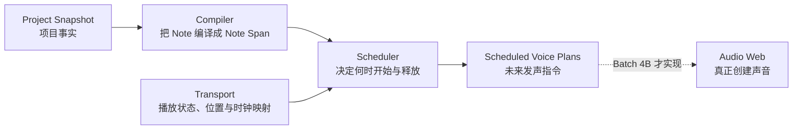

# Audible MIDI Scheduler 工作原理

> Status: Explanatory companion to the implemented Batch 3B Scheduler Planner
>
> Date: 2026-08-12
>
> Scope: `@seele-daw/playback` 中 Compiler、Transport 与 Scheduler 的协作方式

本文面向希望理解 Audible MIDI Playback V1 内部工作原理的产品与工程审阅者。它解释
Batch 3B 已实现的 Scheduler Planner，但不替代
[Audible MIDI Playback V1 第六阶段计划](./audible-midi-playback-v1-phase-plan.md) 中的规范契约。
后续讨论改变产品规则时，应先修改阶段计划，再同步本文。

## 1. 一句话理解

当前播放链路可以理解为四个角色：



- Compiler 回答：项目里有哪些音符需要播放；
- Transport 回答：现在是否播放、播放到哪里，以及项目时间如何对应播放时钟；
- Scheduler 回答：接下来一小段时间内，哪些音符应该在播放时钟的哪一秒开始和释放；
- Audio Web 以后才真正加载采样、创建 Voice 并发声。

Batch 3B 完成的是“可靠排期”，不是“已经能听见声音”。

## 2. 核心术语

| 名词                 | 通俗含义                         | 主要解决的问题                                  |
| -------------------- | -------------------------------- | ----------------------------------------------- |
| `modelRevision`      | 乐谱版本                         | 播放计划是否对应当前项目内容                    |
| `engineGeneration`   | 本轮播放执行计划的代次编号       | 旧的未来播放指令是否仍然有效                    |
| occurrence           | 一个 Note 在编排中的具体一次出现 | 区分共享 Source、不同 Clip 和重叠同音高 Note    |
| Anchor               | 项目时间与播放时钟的同步点       | 把 Tick / Project Second 换算成播放时钟秒       |
| Position / Playhead  | 当前播放到的位置                 | Transport 与未来 UI 的当前时间                  |
| Scheduler cursor     | 已经安排到未来什么时间           | 保证窗口连续，避免重复或漏发                    |
| cadence              | Planner 预期多久被唤醒一次       | 为未来 Timer / Coordinator 提供唤醒配置         |
| horizon              | 每次至少提前安排多远             | 让音频执行层在目标时刻之前收到计划              |
| Scheduled Voice Plan | 一枚 Voice 的浏览器无关排期      | 告诉 Audio Web 播放什么、何时开始、何时 release |

### 2.1 `modelRevision`：项目内容版本

用户移动一个 Note 后，Project Core 会产生新的项目版本：

```text
修改前：modelRevision 20
修改后：modelRevision 21
```

它回答的是：

> 当前编译计划是不是来自同一版 Project Fact？

它不表示用户播放了几次，也不表示 Transport 当前处于 Playing 还是 Paused。

### 2.2 `engineGeneration`：播放执行代次

`engineGeneration` 可以理解为“当前仍然有效的播放执行批次”。例如：

```text
第一次 Play       generation 1
Pause             generation 2
Resume            generation 3
Manual Locate     generation 4
Return to Anchor  generation 5
再次 Play         generation 6
```

本文使用“新 generation 重置 Planner”时，不是把 generation 数字清零。实际含义是：

> Planner 观察到更高的 generation 后，清除上一代的调度 cursor、Anchor 和 occurrence
> 去重状态，然后从新一代的 Transport Mapping 重新规划。

假设 generation 1 已经提前生成以下指令：

```text
Playback Clock 10.80：开始 C4
```

用户在 10.60 Pause 后，generation 已经变成 2。即使旧指令稍后抵达执行边界，也必须因为
generation 过期而被丢弃。

Scheduler 只保证自己不再从旧 Snapshot 生成新指令。已经交给执行层的计划，仍需要未来
Audio Runtime 独立比较 generation；这是旧事件最终不会发声的第二道边界。

### 2.3 occurrence：编排中的一次具体演奏

一个 MIDI Note 实体不一定只在 Arrangement 出现一次。两个 Clip 可以引用同一个 MIDI
Source：

```text
Clip A -> Source 1 -> Note C4
Clip B -> Source 1 -> Note C4
```

两者指向同一个 Source Note，但在编排中是两次不同的演奏。因此当前 occurrence key 使用：

```text
trackId + clipId + sourceId + noteId
```

不能只用 `channel + pitch` 作为身份，因为同音高 Note 可以重叠。两枚同时发生的 C4 必须创建
两个独立 Voice，之后也必须分别 release。

Compiler 会拒绝或避免重复 occurrence；Scheduler 每个 generation 仍保留一个已处理 key
集合，作为窗口 cursor 之外的第二道去重保护。进入新 generation 后，同一个 occurrence 可以
再次被计划，这是重新播放或 Resume 后产生新执行计划的正常行为。

### 2.4 Anchor：两个时间域的对齐点

项目音乐时间和浏览器播放时钟不是同一个时间域：

```text
Project time:  ProjectSecond 0.50 / Tick 960
Playback time: AudioContext.currentTime 105.50
```

当用户 Play 或 Resume 时，Transport 建立一对 Anchor：

```text
anchorProjectSecond = 0.25
anchorPlaybackClockSecond = 105.25
```

它表示“项目第 0.25 秒对应播放时钟第 105.25 秒”。目标播放时刻按以下公式计算：

```text
targetPlaybackClockSecond =
  anchorPlaybackClockSecond
  + targetProjectSecond
  - anchorProjectSecond
```

如果 Note 位于项目第 0.50 秒：

```text
105.25 + 0.50 - 0.25 = 105.50
```

Scheduler 因此要求 Audio Runtime 在 Playback Clock `105.50` 开始该 Note。

Transport 不使用系统 wall clock 代替这套映射。未来 Web Audio 执行必须使用创建 Transport
所对应的 `AudioContext.currentTime`，动画帧和系统时间都不能成为音频调度权威。

## 3. Scheduler 为什么使用 look-ahead 窗口

浏览器主线程 Timer 可能被布局、脚本或后台降频延迟。如果等到 Note 应该发声的瞬间才创建
音频事件，声音就会迟到。Scheduler 因此持续把一小段未来提前交给执行层。

假设配置为：

```text
cadence = 50 ms
horizon = 250 ms
```

含义是：

- 外部 Coordinator 预计大约每 50 ms 唤醒一次 Planner；
- 每次唤醒后，至少让未来 250 ms 的 Note Start 已经完成规划；
- `horizon` 必须大于 `cadence`，这样正常的单次 Timer 抖动不会立即耗尽提前量。

当前 Planner 只验证并消费配置，不创建 Timer。具体默认毫秒数仍须由真实浏览器 benchmark
和听觉 smoke 校准，不能提前写成 Project Fact 或架构真理。

### 3.1 第一个窗口

假设 Play 时：

```text
Anchor Clock = 10.00
Current Clock = 10.00
Horizon = 0.25
```

Planner 首次规划：

```text
[10.00, 10.25)
```

这是半开区间：包含 `10.00`，不包含 `10.25`。恰好在 `10.25` 开始的 Note 留给下一个窗口。

### 3.2 后续窗口

假设下一次唤醒时当前时钟是 `10.05`，但上一批已经规划到 `10.25`：

```text
from = previous planned-through = 10.25
to = current + horizon = 10.05 + 0.25 = 10.30
```

新窗口只有：

```text
[10.25, 10.30)
```

窗口由前一批的右边界继续，而不是重新从当前 Playhead 开始：

```text
[10.00, 10.25)
[10.25, 10.30)
[10.30, ...)
```

这样可以同时保证：

- 没有重叠重复；
- 没有时间空隙；
- 边界上的 occurrence 只属于一个窗口。

窗口最终会被 `timelineEndTick` 对应的 Playback Clock 截断。`arrangementEndTick` 只表示真实
Clip 内容的中性末端；短项目在内容末端之后仍会推进无 Voice Start 的空窗口，直到共享时间轴
末端。

## 4. Playhead 与 Scheduler cursor 的区别

假设当前真实播放位置为 `10.05`，Scheduler 已提前安排到 `10.30`：

```text
Playhead / current position = 10.05
Scheduler cursor            = 10.30
```

- Playhead 表示“现在播放到哪里”；
- Scheduler cursor 表示“未来已经可靠安排到哪里”。

两者通常不相等。Scheduler 必须跑在 Playhead 前面，未来的视觉 Playhead 也不能直接使用
Scheduler cursor，否则 UI 会显示成提前播放。

## 5. `planNextWindow()` 的完整流程

当前入口是：

```ts
planner.planNextWindow(transportSnapshot)
```

每次调用依次执行：

1. 验证 Transport Snapshot 的 `modelRevision` 与 Timeline End 对应 Planner 的同一份编译
   计划；TempoMap 则从该计划的冻结 Segments 重建；
2. 验证 generation 是安全整数，并且没有退回已经过期的旧 generation；
3. 如果 Transport 不是 Playing，返回 `inactive`，不生成 Voice；
4. 如果观察到新 generation，从它的 Anchor 初始化 cursor 和 occurrence 去重集合；
5. 如果同一 generation 的 Anchor 被擅自改变，失败关闭，因为旧批次将不再拥有一致映射；
6. 根据当前 Position 和 Anchor 计算当前 Playback Clock；
7. 计算连续窗口：

```text
from = previous planned-through
to = min(current Playback Clock + horizon, Timeline End)
```

8. 从排序后的 Note Spans 中读取 Start 落入 `[from, to)` 的 occurrence；
9. 用同一 TempoMap 和 Anchor 把 Start Tick / End Tick 转成 Playback Clock Second；
10. 应用 late / expired policy；
11. 生成冻结的 Scheduled Voice Plans；
12. 整批成功后才提交新的 cursor 和 occurrence 去重状态。

最后一步使一次 Planner 调用具有事务式边界。如果中间发现无效 Route、倒退 generation 或不一致
Mapping，不会留下“窗口只推进一半”的内部状态。

## 6. Timer 迟到时的处理

假设存在两个 Note Span：

```text
Note A: 10.00 start, 10.50 release
Note B: 10.50 start, 10.75 release
```

但 Planner 第一次运行已经到了 `10.60`。

### 6.1 整枚 Span 已经过期

Note A 的 release 已经早于当前时刻：

```text
release 10.50 <= now 10.60
```

Scheduler 丢弃 Note A，并增加：

```text
expiredSpanDropCount += 1
```

此时重新播放已经结束的音符只会制造错误节奏。

### 6.2 Start 迟到，但 release 仍在未来

Note B 的 Start 已经过期，但 release 尚未来临：

```text
start 10.50 < now 10.60 < release 10.75
```

Scheduler 输出：

```text
actual start = 10.60
release      = 10.75
timing       = late-immediate
```

它不会把 Note 整体顺延到 `10.60 -> 10.85`，因为那会改变 Project 中原有的节奏和 Note End。

Late 和 expired 只形成每批有界计数，不为连续迟到的每枚 Note 直接制造 Toast。后续 Runtime
可以把这些计数接入诊断面板或聚合反馈。

## 7. Generation 生命周期示例

### 7.1 Play

```text
Stopped generation 0
-> Play
Playing generation 1
```

Scheduler 从 generation 1 的 Anchor 建立第一个窗口。

### 7.2 Pause

```text
Playing generation 1
-> Pause
Paused generation 2
```

Planner 收到 Paused Snapshot 后返回 `inactive`。未来 Audio Runtime 还必须使 generation 1 的
future events 失效并释放活动 Voice；当前 Batch 3B 没有执行这些音频操作。

### 7.3 Resume

```text
Paused generation 2
-> Resume
Playing generation 3 with a new Anchor
```

Scheduler 清除旧代 cursor 和已处理 occurrence，从 generation 3 的新 Anchor 开始规划。

### 7.4 Manual Locate

Manual Locate 把 Project Tick 映射成新的 Project Second / Playback Clock Anchor，并产生新
generation。Playing 下 Planner 从目标后的新窗口继续；Stopped / Paused 下 Planner 保持
`inactive`。当前不执行 Note Chase，因此目标之前已经开始的长 Note 不会补触发。每次成功定位
同时替换运行时 `returnAnchorTick`。

### 7.5 Return to Last Start Position

Return to Last Start Position 产生新 generation，并把 Transport 放回 Stopped /
`returnAnchorTick`。初始 Anchor 是 Tick `0`，但成功 Manual Locate 后它是最后一次定位目标；
下一次 Play 从该位置建立新 Playback Clock Anchor。重复在 Stopped / Return Anchor 状态执行是
No-change。

### 7.6 Natural End

自然到达 Timeline End 时 Transport 进入 Stopped，但不额外增加 generation。Planner 停止生成
窗口。下一次 Play 会增加 generation 并从 Tick `0` 建立新 Anchor。Timeline End 至少为项目起始
拍号的 150 小节，并在 Clip 内容更长时精确扩展，因此它可能晚于 `arrangementEndTick`。

## 8. Resume 为什么不追赶 Anchor 之前的长 Note

假设一枚 Note 位于：

```text
Project 0.00 -> 0.50
```

用户在 Project `0.25` Pause，稍后 Resume。新的 Anchor 是：

```text
anchorProjectSecond = 0.25
anchorPlaybackClockSecond = 105.25
```

该 Note 的 Start 在 Anchor 之前：

```text
0.00 < 0.25
```

当前 V1 不做 Note Chase，因此不会从 Note 中间重新触发它。下一枚位于 Project `0.50` 的 Note
则会被安排到：

```text
105.25 + 0.50 - 0.25 = 105.50
```

Note Chase 不能只靠补发 Note On 完成。真实实现还需要定义采样偏移、包络阶段、踏板、共鸣和
Effect 状态，因此保留为独立产品切片。

## 9. Scheduled Sample Voice Plan

当前每枚计划包含：

```text
engineGeneration
occurrenceKey

soundbankId
instrumentDeviceId
trackId

masterGain
trackGain
pan

pitch
velocity
channel

startPlaybackClockSecond
releasePlaybackClockSecond
timing: on-time | late-immediate
```

这使未来 Audio Web 不需要读取完整 Project Model。它只需要理解：

> 使用哪个 Soundbank，以什么 Pitch、Velocity、Gain 和 Pan，在对应 AudioContext 的哪一秒开始，
> 并在哪一秒进入 release。

一枚 Voice 的 release 可以位于当前 look-ahead 窗口之外。只要 Start 落在本窗口，Scheduler 就会
把完整 release 目标一起交给执行层，避免之后再用不稳定的 Note Off 身份追认同一 Voice。

## 10. 当前实现的失败关闭边界

Planner 会拒绝：

- horizon 不大于 cadence，或两者不是合法 Playback Clock Duration；
- 重复 Track Route；
- 无效、倒序或重复 occurrence 的 Note Span；
- Note Span 找不到可发声 Track Route；
- Transport Snapshot 来自不同 Project Plan；
- 已经观察到更新 generation 后再次收到旧 generation；
- 同一 generation 在不失效旧计划的情况下改变 Anchor；
- 无法安全表示的 Playback Clock 计算结果。

Compiler Plan、Track Route、Tempo Segments 和 Note Spans 会在 Planner 创建时复制或规范化，
之后修改调用方输入不能改变既有 Planner 的含义。输出 Batch、Window、Diagnostics 和 Voice Plan
也全部冻结。

## 11. 当前 Scheduler 不负责的内容

Batch 3B 尚未实现：

- Timer 或 `setInterval`；
- AudioContext；
- Sample Manifest、加载与解码；
- AudioBufferSourceNode 或其他 Voice；
- 真实 Note Off、release envelope 或钢琴尾音；
- 取消已经交给音频系统的 future event；
- `allNotesOff`；
- Studio Play / Pause 按钮和当前时间；
- Project Commit 后的自动重编译与 Runtime 交接；
- 任何实际声音。

当前完成的链路是：

```text
Project Note
-> Compiler Note Span
-> Transport time mapping
-> Scheduler future Voice Plan
```

下一阶段仍需先完成资产与 Manifest Gate，再由 Audio Web 把 Voice Plan 变成真实采样声音。

## 12. 后续讨论入口

以下问题已明确不由 Batch 3B 偷偷决定，适合后续逐项讨论：

1. Audio Runtime 如何同步取消旧 generation 的 future events，并对活动 Voice 执行
   `allNotesOff`；
2. Sample 短于 MIDI Note 时自然结束、循环维持还是采用其他策略；
3. Sample 长于 MIDI Note 时如何执行 Note Off、release envelope 和物理钢琴尾音；
4. Studio Grand 的力度层、制音、共鸣、踏板和真实感要在 V1 做到什么程度；
5. cadence / horizon 的默认值如何通过 Chrome 长任务、网络、解码和听觉 benchmark 校准；
6. Project Commit 发生在已规划 horizon 内时，Coordinator 如何切换 modelRevision 和
   generation；
7. 是否以及何时增加 Note Chase、Seek、Loop 与播放中增量更新；
8. Runtime 加载失败、部分 Sample Zone 缺失和迟到统计如何呈现在 Studio。

## 13. 对应实现与测试

- [MIDI Compiler](../src/compiler/audible-midi-compiler.ts)
- [Transport Mapping](../src/transport/audible-midi-transport.ts)
- [Scheduler Planner](../src/scheduler/audible-midi-scheduler.ts)
- [Scheduler tests](../src/__tests__/audible-midi-scheduler.spec.ts)
