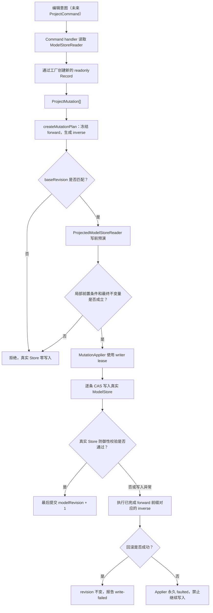

# Project Core 阶段成果：安全模型与原子 Mutation 内核

> Checkpoint：2026-07-17
>
> Git tag：`checkpoint/project-core-foundation-2026-07-17`
>
> 性质：实现快照，不是正式 release、SemVer 版本或公共 API 稳定性承诺。

## 文档目的

本阶段回答了 Project Core 的三个基础问题：

> 项目数据应该如何安全存在、如何被修改，以及修改失败后如何恢复？

当前实现已经建立从领域值、规范化存储、跨实体校验到可逆事务写入的最小闭环。它为后续 Command、History、Query、Snapshot 和持久化提供可信的数据内核，但还不是完整的用户编辑管线。

本文是阶段性成果说明，负责把已经实现的模块、数据关系和运行链路连接起来。字段与不变量的详细规范仍以 [MIDI Project Model V1](./midi-project-model-v1.md) 为准；Record 与生命周期对象的取舍见 [Record、Class 与生命周期协作者](./records-classes-and-lifecycles.md)。

## 阶段结论

Project Core 当前已经形成：

```text
领域输入
→ 受验证的 readonly Record
→ 私有规范化 ModelStore
→ 跨实体 InvariantValidator
→ 可逆 MutationPlan
→ Copy-on-write 写前投影
→ 单写者 CAS 写入
→ 成功提交 revision 或失败恢复旧状态
```

这里最重要的成果不是某一个实体接口，而是建立了一套受约束的数据修改协议：

- 项目事实只有一份，保存在 `ModelStore`；
- 实体 Record 逻辑不可变，修改产生新 Record；
- 只有 `MutationApplier` 能取得一个 Store 的写权限；
- 计划在触碰真实数据前必须完成投影验证；
- 成功计划只递增一次 `modelRevision`；
- 意外写入失败会回滚已经完成的部分；
- 无法可靠回滚时停止写入，而不是继续使用未知状态。

## 当前成果边界

### 已经实现

- opaque Brand ID、Tick、MIDI 标量和领域值校验；
- Project、Track、Channel、MIDI Clip、MIDI Source、MIDI Note、Device、Tempo 和 Time Signature Record；
- 递归 `JsonValue` 安全边界；
- 私有、规范化的 `ModelStore` 和只读 `ModelStoreReader`；
- 最小合法项目初始化；
- 跨实体不变量诊断与强制校验；
- 类型化、可逆的 Project Mutation 词汇；
- `MutationPlan` 的复制、冻结、inverse 生成和来源证明；
- copy-on-write 写时投影；
- 独占 writer lease、细粒度 CAS 写入、revision 提交和防御性回滚；
- 覆盖上述边界的单元测试和架构约束测试。

### 尚未实现

- 产品级 `ProjectCommand` 和 Command handler；
- `ProjectSession` 门面与成功提交发布；
- `ProjectCommit`、`ProjectDelta` 和订阅通知；
- History、Undo/Redo 和手势合并；
- QueryIndex、selector 和局部订阅；
- 稳定 `ProjectSnapshot`；
- `ProjectFileDTO`、schema version、迁移和持久化适配器；
- Journal、崩溃恢复、云同步和多端并发协议；
- Playback compiler、音频运行时和 UI 生命周期对象。

因此，当前“提交”仅表示内存中的模型事务成功，并不表示已经保存到磁盘，也不等同于未来的 `ProjectCommit` 对象。

## 核心存储选择

本项目采用：

> 私有的受控可变实体表 + 逻辑不可变实体 Record + 提交级不可变外部语义。

`ModelStore` 内部允许对 Map 和显式顺序集合执行受控的 `set`、`delete` 和 `splice`，但包外不能取得这些容器。Track、Clip、Source、Note 等 Record 不在原对象上修改；修改时创建新 Record，再由唯一写入口替换旧记录。

这里的“不可变”目前是 TypeScript `readonly` 与开发约定共同形成的逻辑不可变契约，并不表示每个 Record 和所有嵌套 payload 都已经运行时 deep-freeze。MutationPlan 会冻结自己拥有的计划外壳和数组，但不会深冻结共享的领域 Record。

这一组合同时获得：

- Map 的按 ID 查找与局部更新效率；
- 不可变 Record 的引用相等语义；
- Mutation 的精确增量表达；
- 无需为一次 Note 编辑复制整张大型表；
- 未来 Query、Playback 和 Persistence 可以消费同一提交结果，而不成为第二份事实源。

## 权威模型的组织方式

```text
ModelStore
├── modelRevision
├── project
├── master
├── trackOrder: TrackId[]
├── tracks: Map<TrackId, TrackRecord>
├── clips: Map<ClipId, ClipRecord>
├── midiSources: Map<MidiSourceId, MidiSourceRecord>
├── midiNotesBySource
│   └── Map<MidiSourceId, Map<NoteId, MidiNoteRecord>>
├── tempoEvents: Map<TempoEventId, TempoEventRecord>
├── timeSignatureEvents
│   └── Map<TimeSignatureEventId, TimeSignatureEventRecord>
└── devices: Map<DeviceId, DeviceDescriptor>
```

实体表负责身份和快速查询；ID 引用负责实体关系；ID 数组负责显式顺序。Map 的插入顺序不是领域语义，Snapshot 和 DTO 如需确定性输出，应在对应边界稳定排序。

## `trackOrder`：显式表达 Track 顺序

Track 表擅长回答：

```text
给定 TrackId，这条 Track 是什么？
```

它不应该隐式回答：

```text
哪条 Track 位于项目中的第一、第二或第三位？
```

即使 JavaScript Map 保留插入顺序，删除、inverse insert、迁移和重建都可能改变其迭代顺序。依赖 Map 顺序会把容器实现细节变成隐藏领域规则。因此项目通过独立的 `trackOrder: TrackId[]` 保存规范顺序：

```text
tracks
  track-bass  → InstrumentTrack(name: Bass)
  track-drums → InstrumentTrack(name: Drums)
  track-piano → InstrumentTrack(name: Piano)

trackOrder
  [track-drums, track-piano, track-bass]
```

读取有序 Track 时先遍历 `trackOrder`，再根据 ID 查询 Track 表。这样：

- 修改 Track 名称、颜色或设备拓扑不会改变顺序；
- 调整顺序不需要重建任何 Track Record；
- 将最后一条 Track 移到第一条，不需要批量改写其他 Track 的 `index` 字段；
- 顺序作为显式项目事实可以被校验，并可由可逆 Mutation 恢复；文件保存和用户级 Undo 尚未实现。

全局不变量要求：

- 每个 Track 必须在 `trackOrder` 中恰好出现一次；
- `trackOrder` 不能引用不存在的 Track；
- 同一个 Track ID 不能重复出现。

`trackOrder` 当前只表达项目的平面规范顺序，例如编曲区和 Mixer 的默认排列。它不表达父子分组、Folder、音频路由、Send/Bus 或 Clip 播放关系。未来引入层次结构时，可以演进这张有序关系，而不改变 Track 的实体身份。

## Clip、Source 与 Note 的职责

这三个概念分别回答不同问题：

| 概念   | 回答的问题                                  | 主要数据                                                     |
| ------ | ------------------------------------------- | ------------------------------------------------------------ |
| Track  | Clip 属于哪条编曲轨道？                     | Track 身份、类型、通道和设备拓扑                             |
| Clip   | 内容放在项目时间线的哪里、播放哪一段？      | `trackId`、`startTick`、`spanTick`、`sourceId`、offset、loop |
| Source | Clip 背后的内容本体及其局部时间范围是什么？ | Source 身份和 `lengthTick`                                   |
| Note   | Source 局部时间中的具体 MIDI 事件是什么？   | start、duration、pitch、velocity、channel                    |

可以把 Clip 理解为编曲时间线上的“播放窗口”，Source 是窗口背后的“内容原稿”，Note 是原稿中的具体内容。

例如：

```text
Instrument Track T1

MidiClip C1
├── trackId: T1
├── startTick: 30720
├── spanTick: 15360
├── sourceId: S1
├── sourceOffsetTick: 0
└── loop: null

MidiSource S1
└── lengthTick: 15360

Note partition S1
├── Note N1: startTick 0
├── Note N2: startTick 960
└── Note N3: startTick 1920
```

这里存在两套时间坐标：

- `Clip.startTick` 位于项目编曲时间线；
- `Note.startTick` 位于 Source 的局部时间线。

将 Clip 在编曲区移动，只需要替换 Clip；Source 和 Note 不变。在音符仍落于当前 Source 长度范围内时，编辑 Piano Roll 中的音符只需要替换 Source 分区中的 Note，Clip 的编曲位置不变；如果编辑需要扩展内容边界，计划还必须同时调整 Source 或约束 Note。裁剪或循环通常改变 Clip 的播放窗口，不要求破坏性删除 Source 中窗口外的内容。

### Note 为什么按 Source 分区

Note 的物理存储结构是：

```ts
Map<MidiSourceId, Map<NoteId, MidiNoteRecord>>
```

`MidiNoteRecord` 本身不重复保存 `sourceId`。它属于哪个 Source，由外层分区键表达；需要跨边界定位一个 Note 时，使用 `{ sourceId, noteId }` 地址。

这种设计带来：

- 查询一个 Source 的全部 Note 不需要扫描项目全表；
- 删除 Source 时可以整体处理其 Note 分区；
- Note Record 不会携带一份可能与物理分区冲突的所有者字段；
- Piano Roll 可以自然地以一个 Source 为编辑范围；
- 将来可以针对大型 Source 独立优化索引和窗口查询。

虽然 Note 按 Source 分区，Note ID 仍要求在项目内全局唯一；分区解决的是所有权和访问局部性，不是降低 ID 唯一性范围。

底层存储不会在删除 Clip、Source 或 Note 分区时自动级联其他实体。未来 Command handler 必须根据产品语义显式生成完整的 Mutation 集合，投影和全局不变量再负责拒绝缺少必要关系变更的计划。

### 当前 Source 的复制语义

MIDI V1 采用普通复制产生独立内容的产品语义：

```text
复制前
  Clip C1 → Source S1 → Notes N1/N2

复制后
  Clip C1 → Source S1 → Notes N1/N2
  Clip C2 → Source S2 → Notes N3/N4
```

产品规则要求新 Clip 获得新的 Source 和新的 Note 身份，使编辑复制件不会影响原件。当前不变量已经强制一个 `MidiSource` 被且仅被一个 Clip 引用；实际执行这项复制语义的 Command 尚未实现。

未来若加入 Linked Clip 或 Alias Clip，可以允许多个 Clip 共享同一个 Source，但届时必须同时定义共享编辑、删除、解除链接和历史语义，并放宽当前单一所有权规则。当前阶段不提前承担这组复杂度。

## 项目初始化链路

最小项目初始化由受信任边界完成：

```text
调用方提供 Project / Tempo / Time Signature ID 和项目名称
→ 创建 Project Record
→ 创建 120 BPM @ Tick 0
→ 创建 4/4 @ Tick 0
→ 创建 Master Channel
→ 创建空的 Track / Clip / Source / Note / Device 表
→ ModelStore 防御性复制并取得容器所有权
→ assertModelInvariants
→ 返回 modelRevision = 0 的合法 ModelStore
```

初始化器只负责结构性默认值，不擅自添加产品模板中的 Track、Device 或内容。

## 编辑数据链路

当前已经实现的事务链位于 Mutation 层。Command 层尚未实现，因此现阶段由内部调用者或测试直接提供 `ProjectMutation[]`；未来 Command handler 会成为这条链的正式入口。



### MutationPlan

`MutationPlan` 表达一次封闭、可逆的底层变化：

```text
baseRevision
forward mutations
inverse mutations
```

调用方只提供 forward，工厂以反向执行顺序生成 inverse：

```text
forward = [A, B, C]
inverse = [C⁻¹, B⁻¹, A⁻¹]
```

计划工厂复制并冻结自己拥有的 mutation 外壳和数组，并使用内部来源证明拒绝结构相似但未经工厂配对的伪造计划。Payload Record 仍共享引用，遵守逻辑不可变契约。

### 写前投影

`ProjectedModelStoreReader` 不复制整个项目，也不修改真实 Store。它通过实体表 overlay、删除标记以及按需复制的 `trackOrder` 和 Note 分区，依次预演全部 forward mutation。

投影阶段检查：

- insert 目标当前是否不存在；
- remove/replace 的 `before` 是否仍是当前 Record 引用；
- Track 顺序 index 和 ID 是否匹配；
- Note 分区内容是否符合计划前置状态；
- 完整 forward 执行后的跨实体图是否满足所有不变量。

多实体计划的中间步骤可以暂时缺少引用关系。例如创建一条包含内容的 Track 可能依次插入 Track、顺序、Source、Note 分区和 Clip；只要求最终投影视图合法。投影失败发生在任何真实写入之前。

## `modelRevision`：事务级新鲜度

`modelRevision` 是单个运行时 `ModelStore` 的单调递增版本：

- 新项目从 `0` 开始；
- 一个成功 MutationPlan 只增加 `1`；
- 拒绝或成功回滚不增加；
- Undo 未来仍是一次新提交，因此继续增加，而不是把 revision 倒退；
- revision 达到安全整数上限时，在写入前拒绝继续递增。

`baseRevision` 提供事务级的粗粒度新鲜度检查。如果计划基于 revision 5 创建，而 Store 已经到 revision 6，计划在投影前就被拒绝。

它不是持久化字段，也不是文件 schema version、Journal sequence、云端版本或 Git commit。不同版本概念必须保持独立。

## CAS：比较符合预期才写入

CAS 通常指 Compare-And-Swap。在本项目中，它表达细粒度的“比较符合预期才执行容器写入”协议：

```ts
const current = table.get(id)

if (current !== expected) {
  throw new Error('state no longer matches the plan')
}

table.set(id, next)
```

不同操作携带不同预期：

- insert 期望目标不存在，即 `expected === undefined`；
- replace 期望当前对象引用严格等于 `before`；
- remove 期望待删除对象引用严格等于 `before`；
- Track 顺序 insert 检查 index 边界；
- Track 顺序 remove 检查 index 边界和该位置的 Track ID；
- Track 顺序的重复、遗漏和悬空引用由最终全局不变量检查；
- Note 分区删除检查完整 expected Record 集合；
- revision 提交检查当前 revision，并且只能前进一次。

引用比较之所以可靠，是因为实体使用逻辑不可变更新：同一个 ID 的新版本是一个新 Record 引用。旧计划持有的 `before` 一旦不再是表中的当前引用，就会被廉价地识别为过期状态。

`baseRevision` 与 CAS 分别保护不同粒度：

- `baseRevision` 检查整个事务基于哪个模型版本；
- CAS 检查每一个真实 primitive 写入仍面对计划预期的具体记录或顺序位置。

这里借用的是 CAS 的协议语义，不是 CPU 的无锁原子指令，也没有使用 `Atomics`。当前 ModelStore 不跨 Worker 共享，也不使用 CAS 解决多标签页、云同步或多人协作冲突。

## Writer lease：一次性独占写能力

Writer lease 可以理解为修改某一个 `ModelStore` 的唯一钥匙，更准确地说是一份一次性独占 capability：

```text
ModelStore
  └── 注册捕获 #private 字段的细粒度写闭包
          ↓
  WeakMap<ModelStore, ModelStoreWriteAccess>
          ↓ 只能领取一次
  MutationApplier
```

`ModelStore` 构造时创建一组只能执行具体 CAS primitive 的闭包。闭包能够访问 ECMAScript `#private` 字段，但不会公开 Map、数组、通用 setter 或任意 path patch。

`MutationApplier` 构造时领取这份 write access，注册项在返回前立即删除：

- 第一个 Applier 可以领取；
- 第二个 Applier 无法为同一个 Store 再次领取；
- 普通内部模块和包外代码没有写入口；
- 已领取的能力不能重新注册或恢复。

内部 `WeakSet` 记住 Store 曾经注册过，防止同一个 Store 再造一把钥匙；WeakMap/WeakSet 又不会因为注册表而阻止 Store 被垃圾回收。

这里的 lease 不会按时间过期，也没有续租和释放协议。它不是分布式系统中的定时租约，也不是抵御恶意代码的安全沙箱，而是与 Store 生命周期绑定的一次性独占写能力。

这项约束也是回滚可信性的前提：Applier 可以假设 forward 与 inverse 之间不存在另一个合法写者修改 Store。如果回滚失败，当前 Applier 会锁存为 faulted；因为 lease 已被消耗，调用方不能创建第二个 Applier 绕过故障继续编辑。未来 `ProjectSession` 应在此基础上进入 faulted/read-only 状态并要求重新加载。

## 原子应用与失败恢复

当前提供的是同步、单 writer、内存模型级的应用层事务原子性。

### 正常成功

```text
计划真实性通过
→ baseRevision 匹配
→ next revision 可安全计算
→ 投影与最终不变量通过
→ 全部真实 CAS 写入成功
→ 真实 Store 再次通过不变量校验
→ 最后提交 revision
```

revision 写入之后没有其他可能失败的成功路径代码。

### 正常拒绝

陈旧 `baseRevision` 在创建投影前被拒绝；局部前置条件和最终不变量在投影期间被拒绝。三类正常失败都发生在真实写入之前，因此 Store 零写入、revision 不变，Applier 可以继续处理后续合法计划。

### 意外写入失败

如果 forward 为：

```text
[A, B, C]
```

而 A、B 已经完整完成，C 写入失败，则完整 inverse 为：

```text
[C⁻¹, B⁻¹, A⁻¹]
```

Applier 只执行已经完成前缀对应的尾部 inverse：

```text
[B⁻¹, A⁻¹]
```

回滚后还会检查：

- revision 仍为计划的 `baseRevision`；
- 真实 Store 再次满足全局不变量；
- 原计划能够重新从恢复后的 Store 完成投影，证明关键 `before` 引用、顺序和分区已恢复。

恢复成功后向调用者报告 `write-failed`，但 Store 保持旧事务版本。

### 回滚失败

如果 inverse 写入或恢复验证也失败，Store 状态不再被宣称为可信。Applier 保留原始 apply cause 与 rollback cause，锁存 faulted，并永久拒绝后续 `apply`。

停止写入比尝试在未知状态上继续“修复”更安全。未来 Session 可以保留只读诊断能力，但必须通过可信 Snapshot 或持久化边界重新加载才能恢复编辑。

## 每层安全机制解决的问题

| 机制                      | 保护粒度          | 解决的问题                                   |
| ------------------------- | ----------------- | -------------------------------------------- |
| `parse*` / `create*` 工厂 | 值与单个实体      | ID、范围、名称和局部字段是否合法             |
| `InvariantValidator`      | 完整实体关系图    | 外键、所有权、顺序、时间线和内容范围是否合法 |
| `baseRevision`            | 整个事务          | 计划是否基于过期模型                         |
| 写前投影                  | 完整 MutationPlan | 顺序执行是否满足前置条件并得到合法最终状态   |
| writer lease              | Store 写权限      | 谁被允许修改 Store，是否存在第二写者         |
| CAS primitive             | 单次真实写入      | 当前实体引用或位置是否仍符合计划预期         |
| inverse rollback          | 已完成写入前缀    | 意外程序错误后如何恢复旧事务状态             |
| faulted latch             | 不可恢复故障      | 如何阻止未知状态继续被修改                   |

这些机制不是重复检查，而是分别覆盖从输入、关系、计划、授权、真实写入到异常恢复的不同边界。

## “原子”不包含什么

当前原子性不代表：

- 数据已经耐久化到磁盘；
- 浏览器崩溃后能够恢复未保存事务；
- IndexedDB、OPFS 或服务器写入与 ModelStore 同属一个事务；
- 多标签页或多个 Worker 可以共享可写 Store；
- 多人协作冲突已经解决；
- QueryIndex、Playback 和 UI 已收到成功通知；
- 已经创建 History Entry、ProjectCommit 或 ProjectDelta。

这些能力必须在后续边界中分别实现：Snapshot/DTO 负责稳定数据表示，Journal 负责崩溃恢复，云端版本协议负责远程并发，Commit/Delta 负责消费者同步，History 负责用户级 Undo/Redo。

## 其他已建立但尚未闭环的边界

- `JsonValue` 已经能够复制并拒绝循环引用、稀疏数组、非普通对象、访问器、Symbol 和非有限数字，但 `ProjectFileDTO`、序列化、schema 与迁移尚未实现；
- `DeviceDescriptor` 已经提供 JSON 安全的可保存描述外壳，但 Device Definition Catalog、插槽角色兼容、DSP 和 AudioNode 运行时尚未实现；
- `AudioTrackRecord` 类型已经存在，但 Audio Clip、Audio Source 和音频素材引用尚未实现；
- Drum、Vocal 当前不是新的 Track 数据分支，它们更可能由 Track 模板、设备链和后续专用能力组合表达；
- `ModelStore`、初始化器、Validator 和 MutationApplier 仍是包内基础设施，尚未通过公共 `ProjectSession` API 接入 Studio。

## 验证证据

阶段提交前的完整检查覆盖：

- 架构边界检查；
- workspace TypeScript / Vue 类型检查；
- Project Core 12 个测试文件、230 项测试；
- Studio 单元测试；
- Studio production build；
- Oxlint、ESLint、Oxfmt 和 `git diff --check`。

这些结果证明当前实现满足已经编写的契约和测试场景，但不等同于形式化证明，也不覆盖尚未实现的 Command、History、Query 和持久化层。

## 下一阶段

下一阶段应建立产品级 Command 层，把“用户想做什么”连接到已经完成的 Mutation 事务内核：

```text
UI / Editor intent
→ ProjectCommand
→ Command handler
→ 读取 ModelStoreReader
→ 创建新的 Record
→ 生成 ProjectMutation[]
→ createMutationPlan
→ MutationApplier.apply
```

第一条 MIDI 纵向切片可以围绕 Note 的 Add、Move 和 Remove 展开。Command 层应负责产品语义和操作边界，Mutation 层继续只负责规范化事实变化；Move、Resize、Split 的具体边界算法在对应 Command 实现前单独确定。

完成 Command 后，再逐步加入 ProjectCommit/Delta、History、QueryIndex 和 Snapshot。这样每一层都建立在已经验证的单一事实源和原子修改协议之上。

## 阶段验收结论

本阶段可以被概括为：

> Project Core 已具备安全持有并修改规范化项目事实、预演并原子应用可逆变化、在意外失败后恢复或可靠停机的内存事务基础。

它还不能独立支撑完整编辑器工作流，但已经为接下来的 Command、History、Query、Persistence 和 Playback 提供了明确且可验证的内核边界。
