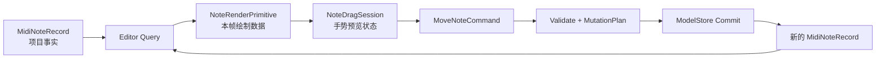

# Record、Class 与生命周期协作者

本文记录 Seele DAW 开发过程中关于“领域实体应该建模为 Class，还是不可变 Record 与函数”的思考。它不是一条要求所有代码都函数式或都面向对象的风格规则，而是一套用于识别状态所有权、生命周期和模块边界的判断方法。

核心结论是：

> Class 应该用于拥有可变状态和生命周期的协作者，而不是仅仅因为用户界面中的概念看起来有生命周期，就让持久化实体本身承担所有生命周期。

理解这句话的关键，在于区分“业务概念的身份”和“软件对象实例的生命周期”。一个用户眼中的音符，在不同系统层中会同时存在多个用途不同、存活时间不同的表示。它们共享 `NoteId`，但不应该因此合并成同一个大对象。

## 不要从名词直接推导 Class

“音符、轨道、工程、设备”都是名词，但名词不是使用 Class 的充分条件。

面向对象入门经常采用下面的映射：

```text
现实世界名词 -> Class
现实世界行为 -> Method
```

这种方法适合帮助理解对象，但不足以指导复杂编辑器架构。真正需要回答的是：

1. 谁拥有当前事实？
2. 谁允许修改这些事实？
3. 状态需要跨多少次调用持续存在？
4. 对象是否拥有必须清理的资源？
5. 对象的实例身份是否有意义？
6. 数据是否需要跨 JSON、Worker、Undo 或持久化边界？
7. 一次行为是否只涉及该实体，还是涉及 Store、History、Index 和 Playback？

Class、Record 和纯函数是三种不同工具。选择依据应当是状态与责任，而不是变量代表的概念像不像现实对象。

## 一个音符同时具有多种生命周期

在 DAW 中，“一个音符被创建、拖拽、选中、播放和删除”看似是一条连续生命周期，实际上至少包含五种彼此独立的生命周期。

| 生命周期            | 典型表示                     | 开始                       | 结束                           | 是否进入项目文件 |
| ------------------- | ---------------------------- | -------------------------- | ------------------------------ | ---------------- |
| 领域实体生命周期    | `MidiNoteRecord`             | Add Note 事务提交          | Remove Note 事务提交           | 是               |
| Record 版本生命周期 | 某个 revision 的 Note Record | 一次 ProjectCommit         | 下一次替换该 Record 的 Commit  | 间接体现         |
| Editor 交互生命周期 | `NoteDragSession`            | `pointerdown`              | commit、cancel、失焦或实体删除 | 否               |
| 渲染表示生命周期    | `NoteRenderPrimitive`        | 进入可见区域或产生绘制批次 | 离开可见区域或下一次重建批次   | 否               |
| 播放 Voice 生命周期 | `ScheduledNoteVoice`         | Scheduler 发出 Note On     | Note Off、Stop 或 Runtime 清理 | 否               |

这些生命周期可能重叠，却不是同一个状态机。

例如，音符滚出屏幕会销毁渲染表示，但不会删除项目里的 Note；用户取消拖拽会销毁交互 Session，但不会撤销音符实体；同一个 Note 在循环播放时可以产生多个 Runtime Voice，但项目中仍只有一条 Note Record。

因此，“音符有生命周期”不能直接推出“`MidiNoteRecord` 必须是一个管理全部行为的 Class”。更准确的结论是：围绕同一个 `NoteId`，不同层次分别拥有自己的生命周期对象。

## 身份、实例与版本不是一回事

下面三个概念很容易被混为一谈：

### 领域身份

```ts
type NoteId = Brand<string, 'NoteId'>
```

只要 Note 仍然是同一个创作实体，`NoteId` 就保持不变。移动、改力度和调整长度不会创建新的领域身份。

### Record 实例

```ts
const before: MidiNoteRecord = {
  id: noteId,
  startTick: oldStartTick,
  // ...
}

const after: MidiNoteRecord = {
  ...before,
  startTick: newStartTick,
}
```

`before` 和 `after` 是两个 JavaScript 对象实例，但表达同一个 `NoteId` 在不同 revision 中的状态。Record 实例可以变化，领域身份不变。

### UI 或 Runtime 实例

一次拖拽可以创建一个 `NoteDragSession`，一次播放可以创建一个 Voice，一次可见区域查询可以产生一个 Render Primitive。它们都引用同一个 `NoteId`，但各自拥有独立实例身份和销毁时机。

架构设计的目标不是让一个对象实例活得和现实概念一样久，而是让每种状态由正确的所有者管理。

## Project Record 为什么适合保持简单

`MidiNoteRecord` 的职责是表达可保存、可撤销、可查询的项目事实：

```ts
interface MidiNoteRecord {
  readonly id: NoteId
  readonly startTick: Tick
  readonly durationTick: Tick
  readonly pitch: MidiPitch
  readonly velocity: MidiVelocity
  readonly channel: MidiChannel
}
```

它不拥有：

- Selection；
- hover；
- Pointer Capture；
- 拖拽起点和当前预览位置；
- Canvas 像素坐标；
- Vue 组件挂载状态；
- Scheduler Event Key；
- Active Voice；
- AudioNode；
- History Entry。

这些字段不只是“暂时还没加入”，而是属于其他状态所有者。如果把它们加入 Project Record，就会产生多种生命周期之间的耦合：

- 选中音符会让项目变脏；
- pointermove 每帧写入 Undo 历史；
- 离开可见区域可能被误解为删除实体；
- 保存项目时必须过滤 UI 字段；
- Playback 和 Editor 开始争夺同一对象的写权限；
- Worker、JSON 和 Snapshot 需要恢复原型和临时状态。

保持 Record 简单，使其可以被规范化实体表持有，以新记录替换旧记录，并明确地进入 Snapshot、Delta、Undo 和持久化流程。

## 真正适合 Class 的协作者

这里的“协作者”是指：为了完成某项职责，需要在多次方法调用之间保存内部状态，或管理依赖、资源和协议顺序的对象。

### 交互 Session

```ts
class NoteDragSession {
  readonly noteId: NoteId
  readonly originStartTick: Tick

  private previewStartTick: Tick
  private state: 'active' | 'committed' | 'cancelled'

  updatePointer(pointerX: number): void {
    // 更新 Editor Preview，不修改 ProjectModel
  }

  createCommand(): MoveNoteCommand {
    // 根据最终 Preview 创建一次正式命令
  }

  cancel(): void {
    // 清理 Pointer Capture、Preview 和其他临时资源
  }
}
```

这里使用 Class 是自然的，因为：

- Session 有明确的 active、committed、cancelled 状态；
- Pointer Event 会多次调用同一个实例；
- 内部状态不应被任意外部代码改写；
- commit 和 cancel 之后不应继续 update；
- 实例负责清理本次手势拥有的资源。

### ModelStore

`ModelStore` 适合使用 Class，因为它需要封装私有 Map、当前 revision 和唯一写权限。外部不应该取得它的可变容器。

### HistoryController

它持有 Undo/Redo 栈、当前位置和 merge session。调用顺序会改变后续行为，实例内部状态具有持续性。

### QueryIndex

它持有可重建但可变的索引，并需要在 apply、rebuild 和 fault recovery 之间保持一致状态。

### ProjectSession

它组合 CommandProcessor、ModelStore、History、Query 和 Publisher，并管理整个编辑会话的依赖与生命周期。

### Runtime Device 与 Voice

AudioNode、Worklet 端口、Scheduler token 和 dispose 协议都是真实资源。此类对象通常需要 Class 或同等能力的闭包状态机来保证创建和销毁成对发生。

## 从拖拽到提交的完整边界



操作过程：

```text
pointerdown
-> 创建 NoteDragSession

pointermove
-> 更新 Editor Preview
-> 重绘预览
-> 不写 ProjectModel

pointerup
-> Session 生成 MoveNoteCommand
-> project-core 验证本地与跨实体不变量
-> 一次事务替换 MidiNoteRecord
-> 产生一个 ProjectCommit 和一个 History Entry
-> 销毁 NoteDragSession
```

这个流程同时使用 Record、纯函数和 Class。它们并不互相排斥，而是分别承担事实、变换和生命周期。

## “创建”和“销毁”需要先问是哪一层

用户说“创建一个音符”时，系统可能执行：

1. Editor 创建 Draw Preview；
2. pointerup 产生 AddNoteCommand；
3. Project Kernel 创建 MidiNoteRecord；
4. Renderer 下一次查询产生 Render Primitive；
5. Playback Compiler 产生 Scheduled Event；
6. Runtime 到达时间点后创建 Voice。

用户说“销毁一个音符”时，也可能表示完全不同的事情：

- RemoveNotesCommand 删除一个或多个项目 Note 实体；
- 音符离开 Viewport，Renderer 丢弃绘制数据；
- 用户按 Escape，Editor 取消 Drag Session；
- Stop 被触发，Runtime 结束 Voice；
- Vue 虚拟列表卸载了对应组件。

如果这些“销毁”都交给 `MidiNote.destroy()`，这个方法必须知道 Project、History、Renderer、Selection、Transport 和 Audio Runtime，最终会形成跨层 God Object。

## 为什么不把行为全部做成实体方法

下面的 API 看上去很面向对象：

```ts
note.moveTo(nextTick)
note.resize(nextDuration)
note.delete()
note.select()
note.play()
```

但每个方法实际依赖不同的所有者：

- `moveTo` 需要 Source 边界、Snap 结果、History 和 Delta；
- `resize` 需要产品边界算法和跨实体校验；
- `delete` 需要 Store、Note Table、Selection 清理和原子事务；
- `select` 只属于 Editor Session；
- `play` 需要 TempoMap、Clip 窗口、Track 路由和 Runtime。

如果实体方法内部直接取得这些服务，实体就不再是独立领域对象，而是隐藏的 Service Locator。若把所有依赖都作为方法参数传入，方法又只是在 Class 外壳中的普通函数。

对于 Seele DAW，编辑行为通常跨越多个规范化实体表，因此 Command handler 比单实体方法更适合作为业务操作边界。

## 使用 Class 不自动获得正确性

私有构造函数可以减少错误构造：

```ts
class MidiNote {
  private constructor(/* ... */) {}

  static create(input: MidiNoteInput): MidiNote {
    // validate
  }
}
```

但它不能取代真正的数据边界：

- JSON 不会自动成为合法 Class 实例；
- Worker 消息不应依赖应用对象原型；
- TypeScript `private` 不是外部数据的运行时安全机制；
- 类型断言仍然可以绕过静态限制；
- 单个 Class 无法独立验证 Track、Clip、Source、Device 的关系；
- Undo 和 Journal 仍需要版本化、可迁移的数据协议。

项目正确性最终来自完整管线：

```text
untrusted DTO / ProjectCommand
-> primitive validation
-> local record validation
-> cross-entity invariant validation
-> MutationPlan
-> MutationApplier
-> ModelStore
```

Class 可以封装其中某些组件，但不能替代整条管线。

## 为什么不建议只有静态方法的 Class

```ts
class MidiNote {
  static create() {}
  static validate() {}
  static getEndTick() {}
}
```

这个 Class：

- 没有实例状态；
- 没有资源；
- 没有生命周期；
- 没有依赖注入；
- 不需要构造和销毁。

它只是把模块函数放进一个静态命名空间。ES Module 已经提供了文件边界、私有实现和具名导出：

```ts
export function createMidiNoteRecord() {}
export function getMidiNoteEndTick() {}
```

静态 Class 并非绝对错误，但如果它唯一的理由是“把相关函数放在一起”，模块通常已经足够，而且不需要额外的 Class 概念。

若函数数量增多，应优先检查模块职责是否过大、命名是否清晰、公开 API 是否过宽，而不是自动添加静态 Class 包装。

## 这不是对 Rich Domain Model 的否定

某些领域适合让实体封装大量业务行为。例如一个低数量、边界稳定的 Aggregate 可以通过方法维护内部不变量，而且不会频繁跨序列化和 Worker 边界，此时 Class 可能非常合适。

Seele DAW 当前选择数据导向的 Project Model，是由具体约束决定的：

- Note 数量可能达到十万级；
- 高频编辑针对规范化实体表中的少量记录；
- 操作需要同时生成 inverse mutation、Delta 和 query invalidation；
- 项目需要 Snapshot、Journal、Worker 和持久化；
- UI Preview 与正式提交必须分离；
- Playback Runtime 不读取 Project 对象实例。

因此，Track、Clip、Source、Note 使用 Record 并不是“贫血模型导致的偶然结果”，而是把领域行为放在 Command、Validator、Compiler 等更准确的边界中。

如果未来出现真正只属于某个 Aggregate、能够在不访问全局服务的情况下维护完整不变量的行为，可以重新评估 Class，而不必把当前选择提升为永恒教条。

## Seele DAW 的选择矩阵

| 对象或模块                         | 首选形式                      | 判断依据                           |
| ---------------------------------- | ----------------------------- | ---------------------------------- |
| `ProjectRecord`、Track、Clip、Note | readonly Record               | 可保存事实、按 revision 替换       |
| `MidiLoop`、Channel Descriptor     | readonly Value Object         | 无独立身份或生命周期               |
| Command、Mutation、Delta、DTO      | readonly Record / 联合类型    | 需要传输、模式匹配、测试和序列化   |
| 本地构造与校验                     | 模块纯函数                    | 无跨调用状态、确定性输入输出       |
| Command handler                    | 函数或注入依赖的 handler 对象 | 行为跨实体，应显式接收上下文       |
| `ProjectSession`                   | Class                         | 会话生命周期、依赖组合、故障状态   |
| `ModelStore`                       | Class                         | 私有 Map、revision、唯一写权限     |
| `HistoryController`                | Class                         | Undo/Redo 栈和 merge 状态          |
| `QueryIndex`                       | Class                         | 可变缓存、重建和故障恢复           |
| `NoteDragSession`                  | Class                         | 多事件手势状态、commit/cancel 协议 |
| Renderer                           | Class 或封装状态的模块        | Viewport、缓存、资源和批次生命周期 |
| `NoteRenderPrimitive`              | 临时 readonly Record          | 一帧或一批的绘制输入               |
| Audio Device / Voice Runtime       | Class 或显式状态机            | 真实资源、调度 token、dispose 协议 |
| 无状态 `InvariantValidator`        | 纯函数                        | 没有实例状态时无需 Class           |
| 缓存过 segment 的 `TempoMap`       | Class 候选                    | 若需要封装预计算缓存和查询协议     |

表中的“Class 候选”不是命名要求。一个组件若最终没有状态，也可以保持为函数模块。

## 选择 Class 的检查清单

准备创建 Class 时，可以逐项询问：

1. 是否有状态需要跨多次方法调用持续存在？
2. 是否存在合法的方法调用顺序或状态机？
3. 是否拥有必须释放的资源、订阅、Timer、Pointer Capture 或 Runtime Handle？
4. 是否需要隐藏可变容器，防止外部越权写入？
5. 是否需要在构造时注入长期依赖？
6. 这个实例本身的身份是否有意义？
7. 多个方法是否围绕同一个内聚状态工作？

若多项答案为“是”，Class 通常是合理候选。

若答案主要是下面这些，则优先考虑 Record 与函数：

- 只是保存一组字段；
- 输入确定时输出也确定；
- 数据需要 JSON、Worker、Snapshot 或 History；
- 每次更新都应该产生新版本；
- 需要判别联合和模式匹配；
- 没有资源需要清理；
- 所有方法都是 static；
- 方法必须频繁取得外部 Store 才能工作。

## 代码审阅中的危险信号

### Project 实体出现 UI 字段

```ts
selected
hovered
dragging
x
y
componentRef
```

这通常意味着状态所有权错层。

### 实体方法直接调用全局服务

```ts
note.delete(projectSession, history, renderer)
```

这说明行为并不只属于 Note。

### 每次反序列化都要恢复复杂对象图

如果加载 ProjectFileDTO 后需要为十万 Note 重建带方法实例，应该重新评估这些方法是否真正属于实体。

### Class 只有 getter、setter 和 static 方法

这可能只是普通 Record 与模块函数被包了一层语法。

### 一个对象同时拥有 Project、Editor 和 Runtime 状态

这会导致保存、撤销、渲染和播放共享写权限，是边界泄漏的强烈信号。

## 函数组合方案的代价与应对

Record 与函数并非没有代价。

### 可发现性较弱

方法调用可以通过 `note.` 自动补全发现，而模块函数需要知道名称。

应对方式：

- 按领域文件组织，例如 `midi-note.ts`；
- 使用稳定命名，例如 `createMidiNoteRecord`；
- 只从包公开入口暴露必要 API；
- 避免把所有函数放入通用 `utils`；
- 当函数明显过多时，重新划分模块职责。

### 调用者可能绕过工厂

TypeScript interface 允许构造形状相同的对象，类型断言也能绕过限制。

应对方式不是只依赖语法封锁，而是：

- opaque ID 和 branded scalar；
- local record constructor；
- 跨实体 `InvariantValidator`；
- 私有 ModelStore；
- 唯一 MutationApplier；
- DTO schema validation；
- 提交前全量不变量保护。

Class 的 private constructor 可以减少误用，但仍不能取代这些运行时边界。

### 函数参数可能膨胀

当一个函数开始需要 Store、History、Query、Clock 和 Publisher 时，不应继续增加零散参数。此时应把它提升为拥有明确依赖的 Command handler 或服务对象，而不是让 Record 实体吸收这些依赖。

## 何时重新评估当前选择

出现以下情况时，可以重新讨论某类 Record 是否应成为 Class：

- 该对象产生了真实、长期、私有且跨调用的内部状态；
- 多个操作形成必须封装的调用协议；
- 实例拥有明确资源并负责 dispose；
- 方法可以在不访问全局 Store 的情况下维护完整不变量；
- Class 形式经过 benchmark 证明不会破坏高数量实体路径；
- 序列化、Worker 和 Snapshot 边界已经有清晰的 DTO / rehydrate 方案。

也应在以下情况重新讨论某个 Class 是否应退化为函数模块：

- 实例没有状态；
- 所有方法都是 static；
- 构造函数只保存参数，方法只是无状态计算；
- 每个调用都创建一次实例后立即丢弃；
- Class 主要作用只是提供命名空间。

## 当前决策

Seele DAW 当前采用混合策略：

```text
Project Facts
  readonly Record + validated factory

Domain Transformations
  pure function / Command handler

Stateful Collaborators
  Class or explicit state machine

External Boundaries
  versioned DTO + runtime validation
```

对当前 MIDI 纵向切片而言：

- `MidiNoteRecord`、`MidiSourceRecord`、`MidiClipRecord` 和 `MidiLoop` 保持为只读数据；
- 本地构造使用模块函数；
- 跨实体行为进入 Command handler 和 InvariantValidator；
- `ModelStore`、`ProjectSession`、`HistoryController`、`QueryIndex` 和 Editor gesture session 是 Class 的主要候选；
- 不创建只有静态方法、仅充当命名空间的实体 Class。

最终判断标准不是“哪种写法更像面向对象”，而是：

> 这段状态真正属于谁，它需要活多久，谁有权修改它，以及它跨越哪些边界。
